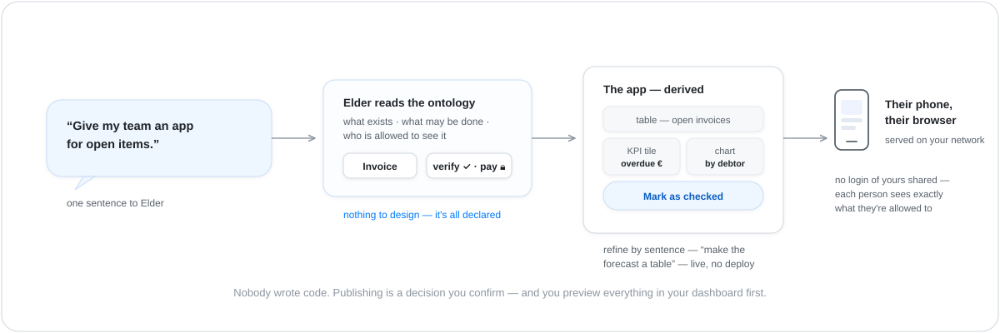

# Apps — what a Tribe hands the people around you

> Concept page — no setup required. The worked example is the
> Liquidity Cockpit in the
> [liquidity tour](showcase-liquidity.md); the engineering record
> is ADR-0154.

Your Tribe knows things worth sharing: which invoices are open,
what the week's energy balance is, which contracts renew soon.
The people who need that — your partner, your team, the
colleague in purchasing — shouldn't need your login, your
dashboard, or a lesson. They should get **an app**: a small,
friendly one that shows exactly their slice and offers exactly
their buttons.

In The Wild, that app costs one sentence:

  

## Why nobody has to write it

The app isn't generated the way a chatbot generates code — there
is **no code to write**. Everything an app needs is already
declared in the Tribe's [ontology](ontology.md): the types worth
listing, the numbers worth totalling, the actions that exist and
who may press them. Elder reads that and composes an **app
description** — this page shows a table of open invoices, that
tile shows the overdue sum, this button fires the *mark as
checked* action. One generic renderer turns the description into
a working app.

That's why refining it is conversation, not a release cycle:
*"show the forecast as a table"*, *"add a page for the partner
ledger"* — the description changes, the app follows, live.

## Safe to hand out

An app is an outward-facing door, so the rules are strict and
simple:

- **Governed per person.** Every viewer sees only what the
  ontology's visibility rules allow them — fields, records, and
  buttons included. A customer-facing view literally cannot show
  an internal note.
- **Actions keep their locks.** The same risk tiers apply as
  everywhere else: a reminder button may be offered; paying
  something never happens without the operator.
- **Publishing is a decision.** Nothing is reachable by anyone
  until you confirm the publish — and you preview the app in your
  dashboard first, exactly as the recipient would see it.
- **It stays home.** Apps are served by the `wild-appd` doorman
  into your own network; your data doesn't move to a cloud to
  become shareable.

## An app just for you

Not every app is for handing out. Ask for one **for yourself** —
*"bau mir einen Bericht über unsere Margen, nur für mich"* — and
Elder builds an **operator app** instead
(ADR-0241):

- **It sees everything you see.** Internal fields — margins, cost,
  internal notes — are exactly what a management view needs, so an
  operator app is not trimmed to the customer lens.
- **It is live immediately.** It appears on your dashboard the
  moment it exists; there is nothing to publish, because there is
  no recipient but you. Customers can never reach it — not even by
  accident.
- **A report is just an app.** Ask for a report and the first
  draft already carries a chart per figure worth charting; refine
  it by sentence like any other app.

When your wish doesn't say who the app is for, Elder asks — "for
you, or for your customers?" is a real decision, not a default.

## What an app can show

The building blocks are deliberately few and familiar: tables and
lists, detail cards, charts, KPI tiles, action forms, and a chat
panel — each bound to the live data underneath. The Liquidity
Cockpit in the [business tour](showcase-liquidity.md) uses most
of them: open receivables, a per-debtor chart, a due-date
calendar, a verify button for the finance group.

> 🔍 **Dig deeper.**
>
> - **Engineering record:** ADR-0154 — operator-published end-user apps (the view contract, app specs, the `wild-appd` gateway).
> - **A real app description:** [`examples/tribes/liquidity-management/apps/liquidity-cockpit.yaml`](../examples/tribes/liquidity-management/apps/liquidity-cockpit.yaml).
> - **The ground it derives from:** [`ontology.md`](ontology.md) · `atlas.md`.
