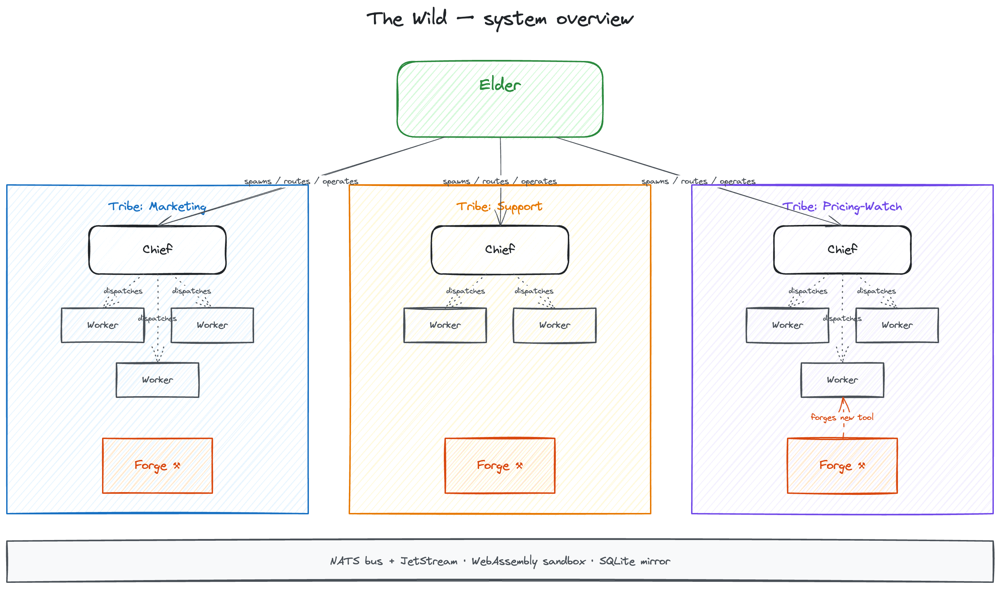

# Architecture

> Technical companion to [`docs/idea.md`](idea.md). The idea doc
> is the *why*; this is the *how*.

## System overview

<a href="assets/wild-internal.excalidraw">
  
</a>

The diagram is the spine of this doc. **Elder** at the top is
the singleton system-tribe orchestrator (one per install,
hardcoded into the `wild` binary). It onboards new Tribes,
routes the user between them, and operates running Tribes (apply
blueprint changes, swap a worker, stop a tribe). Each Tribe
underneath is its own clan: a Chief reading a Markdown Blueprint
every cycle, a few Workers doing the actual tasks, a Forge
ready to build new tools when the Chief notices a missing
capability. Below the Tribes runs the shared substrate — NATS
for messaging, JetStream for durable state, WebAssembly
Components as the sandbox every plugin runs inside, and the
filesystem (`<profile_root>/`) as the canonical per-profile store.

📐 [Edit in Excalidraw](assets/wild-internal.excalidraw)
&nbsp;·&nbsp; [Control-plane view (how the user steers it)](assets/wild-overview.excalidraw)

The rest of this doc walks each layer.

## Process topology — daemon + lean frontend

Per ADR-0035 (daemon split) + ADR-0036 (lean frontend) the runtime
ships as **two binaries**:

- **`wild-hostd`** — the long-running daemon
  (`crates/runtime/daemon/`): one Tokio process that embeds the
  wasmtime host, the Tier-1 providers, and the manager. Plugins live
  as WebAssembly components inside the same wasmtime engine; the host
  gates their imports against operator-granted capabilities. There is
  no network hop between the host and a provider, no SDK lattice to
  debug, and no parallel deploy machinery — the embedded host replaced
  wasmCloud.
- **`wild`** — the lean frontend CLI (`crates/runtime/frontend/`): a
  thin NATS/IPC client. `wild up` spawns `wild-hostd` as a child and
  attaches, supervising it for the lifetime of the invocation;
  `wild up --in-process` keeps the legacy single-binary mode (embedded
  host inside the frontend's own tokio runtime) for tests and scripts.

The full deployment picture — those two binaries plus the `wild-appd`
app server and the remote `wild-forged` build server (ADR-0260) — in
one figure:

<a href="assets/wild-deployment.svg">
  
</a>

```
   ┌──────────────────────────────────────────────────┐
   │            wild-hostd (daemon process)           │
   │                                                  │
   │   ┌─────────────────────────────────────────┐    │
   │   │   wasmtime Engine                        │    │
   │   │   ┌───────┐  ┌──────────┐  ┌────────┐   │    │
   │   │   │ chief │  │ ai-worker│  │ tools  │ … │    │
   │   │   │ (Wasm)│  │  (Wasm)  │  │ (Wasm) │   │    │
   │   │   └───┬───┘  └────┬─────┘  └────┬───┘   │    │
   │   │       │           │             │       │    │
   │   │       └─── wild:* ┴── wasi:* ───┘       │    │
   │   └───────────────────┬─────────────────────┘    │
   │                       │                          │
   │   ┌───────────────────▼──────────────────────┐   │
   │   │        Tier-1 host plugins (Rust)         │   │
   │   │   secrets · messaging · forge · files     │   │
   │   │   tasks · decisions · sessions · data     │   │
   │   │   blobs · tools · cli-exec · …            │   │
   │   └───────────────────┬──────────────────────┘   │
   │                       │                          │
   └───────────────────────┼──────────────────────────┘
                           │
                ┌──────────┴──────────┐
                │                     │
            ┌───▼───┐         ┌───────▼────────┐
            │ NATS  │         │  Filesystem    │
            │  KV   │         │ <profile_root>/│
            └───────┘         └────────────────┘
```

`wild up` spawns and supervises `wild-hostd` (or boots the embedded
host in-process with `--in-process`). Bare `wild` opens the inline
chat REPL (ADR-0010 / ADR-0020); `wild watch` opens the monitoring
console — both attach to a running daemon over NATS and speak the
same JetStream KV / NATS-subject API the components do.

## NATS is the bus, JetStream is the durability

Every inter-component message rides a NATS subject. Subjects are
strictly namespaced:

- `wild.{tribe}.…` — per-tribe traffic (workers, chief loop, user
  channels).
- `wild.system.…` — system-wide (lifecycle, security, config RPC,
  audit events).
- `wild.runtime.embedded.…` — provider→cli bridge subjects.

JetStream KV backs the **distributed** state that crosses tribe
boundaries — the part that needs TTL, watch-streams, and cluster
semantics:

- **tribe-state** — per-tribe cycle lock + pending-tasks + results
  buffer.
- **tribe-registry** — cross-tribe offer/needs discovery (ADR-0041).
- **tribe-linkages** — cross-tribe grant topology (ADR-0031).

How durably a given *subject* is delivered is a declared property, not
a per-call-site choice: `common::subjects::delivery_class` maps every
subject to one of three guarantees, and the host's messaging publish
path routes by that class —

- **Volatile** — fire-and-forget core NATS, at-most-once. The default:
  live telemetry, alerts re-emitted on the next sweep, and the
  cron-/replay-recoverable chief triggers (`boot`/`schedule`/
  `heartbeat`/`reflect`/`user`) a steady-state cron or the deferred
  drain re-fires.
- **Streamed** — core publish captured by a JetStream stream bound at
  bootstrap: at-least-once for the *consumer*, no publisher ack. Worker
  results, operator `give_task`, config- and effect-audit, and the
  **event-driven chief wakes** (`chief.trigger.{result,event,reboot,
  evolve,alarm}` — `WILD_CHIEF_WAKES`), which a per-tribe durable
  consumer replays so a wake published while the chief is down survives
  a restart instead of being recovered only on the next heartbeat.
- **Confirmed** — `js.publish` with an awaited PubAck (the chief
  deferred-wake queue only): at-least-once including the publisher.

A host test (`delivery_class_matches_bound_streams`) cross-checks the
classification against the streams actually bound at bootstrap, so the
declared guarantee and the wiring can't drift.

When a subscriber receives a payload it cannot decode (a poison message)
or fails to deliver one, it routes the raw bytes — with the source
subject + failure reason in NATS headers — to the durable **dead-letter
sink** (`wild.system.deadletter`, JetStream stream `WILD_DEADLETTER`,
7-day MaxAge) via `providers::system::bus::dead_letter`, *before* the
ack/drop that would otherwise lose it silently. Operators inspect it with
`nats stream view WILD_DEADLETTER`.

The full delivery-class model, the complete subject→guarantee map, the
stream inventory, and the durable-wake / dead-letter / identity-header
lanes are in `docs/messaging.md`.

Per-profile durable state is **FS-canonical** (ADR-0026): decisions,
sessions, alarms, traces, escalations, ideas, and the tribe tree all
live as JSONL / Markdown-with-YAML-frontmatter under
`<profile_root>/{decisions,sessions,tribes,…}`. The filesystem *is*
the source of truth — a second process editing a file is observed on
the next read. (Pre-ADR-0026 the host kept a SQLite `tribes.db`
mirror of tribe state for fast local reads; that per-profile-state
SQL stack was fully removed in ADR-0026 F7 — no SQLite mirror of the
canonical state exists today. The one remaining SQLite is
`wild:data`'s derived read-model — an event-sourced projection
rebuilt from the canonical log (`storage/wild_data/sqlite_projection.rs`),
never a source of truth.)

## WebAssembly Components — language-agnostic plugins

Every plugin in The Wild is a **WebAssembly Component**. Concrete
benefits:

- **Language portability.** Rust today, but any language with
  WIT-bindgen support tomorrow (Python, Go, JavaScript). The host
  doesn't know — it sees a Wasm component with declared imports
  and exports.
- **Sandbox by default.** No filesystem, no network, no clock —
  every capability is an explicit WIT import the host has to grant.
  An `http-fetcher` worker imports `wasi:http/outgoing-handler`
  *and only that*; it can't read your home directory or open a
  TCP socket.
- **Deterministic packaging.** A component is a single signed
  binary with embedded metadata. OCI carries it the same way it
  carries containers; trust tiers (Verified / Verified-Local /
  Community / Unknown) ride alongside.
- **Composable.** Components compose at link time. The host wires
  imports to provider implementations on workload start.

The full plugin model (three tiers × five flavors, trust gates,
distribution paths) is in [`docs/plugin-concept.md`](plugin-concept.md).

## Capability model — explicit wiring, no ambient power

Every WIT interface a component imports is gated:

- **WIT shape** — the component declares `imports: [wild:secrets/get,
  wasi:http/outgoing-handler, …]`. wasmtime's component-model
  introspection reads this at instantiation.
- **Capability bundles** — the catalog
  (`common::capabilities::BUNDLE_CATALOG`) maps friendly bundle
  names (`worker.bus.basic`, `ai.chat`, `files.read`) to concrete
  WIT-import sets. A plugin's manifest declares which bundles it
  needs.
- **Trust gate** — Tier-2 plugins (operator-installed Wasm
  components) flow through the trust gate at wiring time. Trust is
  **external, never self-reported** (ADR-0045 §3): the tier is
  derived from the host-recorded `PluginSource` (local install →
  `Verified`; OCI pull → `Unknown` until an operator grant raises
  specific caps). `Unknown` gets a reduced cap allowlist; the gate
  evaluates the plugin's **binary-derived** imports.
- **Binary-derived capabilities** — `provides` / `requires` / `kind`
  come from the component's WIT type section, not a hand-authored
  sidecar (ADR-0045 §2). The host reads the real imports/exports off
  the binary, so a plugin cannot under- or over-declare its caps. An
  exact WIT **version contract** (§5) refuses to wire a plugin whose
  imported version doesn't match what the host offers.
- **Integrity cross-check** — at first instantiation the guest's
  `meta::manifest()` `slug` / `version` must match what the host
  recorded from the OCI ref; a mismatch means the wasm was swapped
  under the tag and is a hard load error. Capability-field
  divergences are warnings (the host uses the binary truth).

The catalog of currently-shipped capabilities is in
`crates/common/src/capabilities.rs`.

## Three tiers, one filesystem layout

Tier is a **delivery axis**; role is a **filesystem axis**. ADR-0014
made these orthogonal:

| Tier | Delivery | Examples |
|---|---|---|
| **Tier-1** | Native Rust, statically linked into the host | `nats_plugin`, `wild_secrets_plugin`, `wild_forge_plugin`, `wild_cli_exec_plugin` |
| **Tier-1.5** | Wasm component, embedded into the host via `include_bytes!` | `plugins/chiefs/default` (default chief; without it nothing runs) |
| **Tier-2** | Wasm component, OCI-pulled at runtime via `wild plugin add` | `ai-worker`, `openrouter`, `anthropic-cli`, `math-tools`, `http-fetcher`, `pdf-parser` |

Role lives at `plugins/<role>/<n>/`:

| Filesystem dir | Role |
|---|---|
| `plugins/chiefs/<n>/` | Chief (per-tribe orchestrator) |
| `plugins/workers/<n>/` | Workload (does work) |
| `plugins/llm/<n>/` | Provider (LLM adapter) |
| `plugins/embed/<n>/` | Provider (embedding adapter) |
| `plugins/storage/<n>/` | Provider (storage adapter) |
| `plugins/tools/<n>/` | Provider (tool provider) |
| `plugins/channels/<n>/` | Provider (operator-channel adapter) |

The deep-dive on tier discriminator + flavor matrix is in
[`docs/plugin-concept.md`](plugin-concept.md).

## Configuration — daemon as source of truth

Per ADR-0009, the daemon owns runtime config — LLM adapters,
plugin trust tiers, plugin/component-type inventory.

- **Mutations** go through NATS request/reply on
  `wild.system.config.{domain}.{op}`. The daemon validates,
  persists, hot-swaps the affected backend, and broadcasts a
  `*.changed` event on JetStream-backed subjects.
- **CLI verbs** (`wild config llm add …`, `wild plugin add …`) are
  thin RPC clients. Same-machine, remote-machine, doesn't matter.
- **The chat / watch frontends subscribe** to the `*.changed` events
  and render activity-log entries automatically.
- **Read-side commands** carry `--json` for NDJSON output (per
  ADR-0010 §F4).

Connection config lives in `<wild_root>/cli.toml`; `wild config show`
prints the resolved chain.

The full env-var inventory is in
[`docs/config-vars.md`](config-vars.md). Every `WILD_*` env read
flows through `wild_runtime::RuntimeConfig::from_env`; CI enforces
the lockdown.

## Forge — the generative pipeline

The Forge is what makes a tribe **generative**. End-to-end:

1. **Chief detects a missing capability.** During Reflect, the
   Chief notices the tribe is bottle-necked by a tool it doesn't
   have ("we keep getting PDF questions and have no parser").
2. **Forge generates source.** The Chief's LLM writes a
   `Cargo.toml`, a `world.wit`, and `src/lib.rs` against a pinned
   crate allowlist (`forge/src/allowlist.rs`).
3. **Sandbox build.** Forge hands the source to a Docker sandbox
   container (`forge-sandbox` image), builds it into a WebAssembly
   component, captures structured failure variants
   (`compile-error`, `sandbox-violation`, `quota-exceeded`).
4. **Lockdown enforcement.** Three layers prevent a prompt-injected
   LLM from forging Storage / LLM-Adapter / Embed-Adapter / Chief
   plugins:
   - Layer A — WIT shape (host's handler enum forbids
     non-tool-provider/workload).
   - Layer B — handler-side flavor enum gate.
   - Layer C — WIT export+import walker validates against the
     pinned baseline for the requested flavor.
5. **Operator approval.** The built component lands as `pending`
   in the YAML catalog (`<profile_root>/component-types/<n>.yaml`).
   Operator runs `wild component-type approve <n>` after
   review; only approved entries are deployable.
6. **Hot-deploy.** The `WildComponentTypePlugin` registers the
   approved component-type; the next cycle uses the new tool.

ADR-0012 documents the catalog format + the lockdown layers.
ADR-0013 documents the parallel `wild:cli-exec` bridge that lets
Tier-2 components shell out to operator-allowlisted CLI tools
(`claude`, `gh`, future ones) without each plugin reinventing
subprocess hardening.

## Component naming — Elder, Chief, Worker

ADR-0002 §1 pinned the three-component split:

| Component | Role | Cardinality | Distribution |
|---|---|---|---|
| **Elder** | System-tribe orchestrator (onboard / route / operate) | 1 per install | Hardcoded into `wild` binary |
| **Chief** | Per-tribe orchestrator (cycle / dispatch / decisions) | 1 per tribe | Pluggable Wasm component (default Tier-1.5; specialised flavors Tier-2) |
| **Worker** | Does the actual work | Many per tribe | Pluggable Wasm component (Tier-2) |

The shared orchestrator core (trigger decode, normalised cycle
events, supervision-loop scaffold per ADR-0005) lives in
`crates/common/src/orchestrator/`. Elder and chief-default are
thin shells over it that bind their role-specific WIT exports +
system prompts.

## What to read next

- [`docs/plugin-concept.md`](plugin-concept.md) — the canonical
  plugin reference (deeper than this section can fit).
- `docs/elder.md` — how Elder runs the
  Intake / Mentor dialogue with users.
- `docs/adr/` — every architectural decision with rationale
  + alternatives + consequences.
- `CLAUDE.md` — the active build / test
  conventions every contributor follows.
