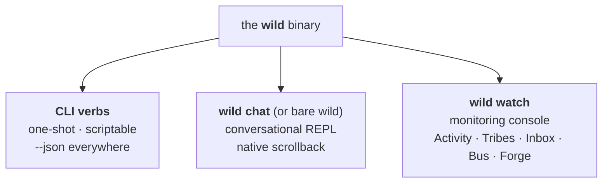
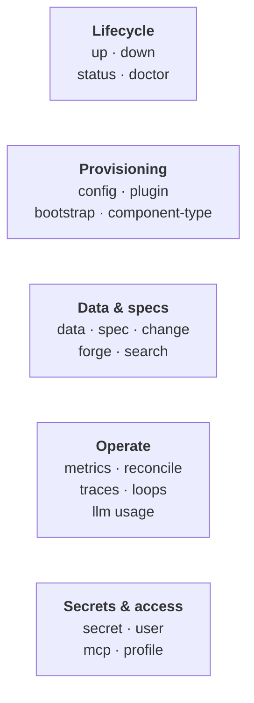

# The CLI

> The **complete** command reference — every verb and flag is here.
> Companion to ADR-0010 (the
> rationale) and [`getting-started.md`](getting-started.md) (the
> friendly first run). House style: `STYLE.md`.

One binary, **three surfaces**. `wild` doesn't run a single all-in-one
TUI; it splits by *what you're doing*:



- **`wild` / `wild chat`** — inline chat REPL with native scrollback / selection.
- **`wild watch`** — full-screen monitoring console (Activity · Tribes · Inbox · Bus · Forge).
- **CLI verbs** — one-shot, scriptable commands (`wild up`, `wild config llm …`).

> 🔍 **Dig deeper — the surfaces.** Chat REPL design (slash matrix,
> streaming): `inline-chat-design.md`. Watch
> console layout: `watch-dashboard-design.md`.

## The split rule

> **"Wäre das in einem Bash-Script sinnvoll? → CLI. Multi-turn Konversation? → chat. Live-Monitoring? → watch."**

A **CLI command** is one-shot, deterministic, scriptable, and exits
cleanly. The **chat REPL** is the conversational surface — talk to
the Elder or a tribe, paste a multi-line message, get the assistant's
streamed reply inline; native terminal scrollback / selection / Cmd-C
all work. The **watch console** is the monitoring dashboard — fixed
panes for Activity, Tribes, Inbox, Bus, Forge, no input field.

| Action | Surface | Reason |
|---|---|---|
| `wild up`, `wild down` | **CLI** | Lifecycle; CI scripts call them |
| `wild status`, `wild doctor` | **CLI** | One-shot health check |
| `wild report` | **CLI + app button** | The file an operator sends when something breaks (ADR-0295) |
| `wild config llm add ...` | **CLI** | Provisioning script |
| `wild tribe apply ./acme.tribe` | **CLI** | Idempotent ops |
| `wild data query scan inflow --tribe acme` | **CLI** | Backup / migration |
| `wild plugin add oci://...` | **CLI** | Operator install |
| `wild metrics --json` | **CLI** | One-shot host metrics |
| `wild traces list --json` | **CLI** | One-shot history read |
| `wild content ls acme` | **CLI** | One-shot capture queue read |
| `wild content rerun acme <blob_ref>` | **CLI** | Re-queue document enrichment |
| `wild flows ls acme` | **CLI** | One-shot Flow read (ADR-0185) |
| `wild flows show <flow> --tribe acme` | **CLI** | Flow spec + recent runs |
| `wild flows feed <flow> --tribe acme` | **CLI** | Hand an item into a Flow (#4597) |
| `wild flows run retry <run-id> --tribe acme` | **CLI** | Re-trigger a failed Flow run (#4112) |
| Multi-turn chat with the Elder / a tribe | **chat REPL** | Interactive, scrollback-friendly |
| `/blueprint edit` (suspend → `$EDITOR`) | **chat REPL** | Multi-step form |
| `/diff <key>`, `/upload <path>`, `/copy`, `/save` | **chat REPL** | Context-aware slashes inline |
| Live multi-tribe Activity + Bus + lifecycle indicators | **watch console** | Continuous render across panes |
| Health summary at-a-glance | **watch console** | Always-visible alongside event stream |

## Command families at a glance

Every family supports `--json` for scripting and `--help` for the
canonical flag list. Jump to one below, or read the full cheatsheet.



## CLI cheatsheet

### Lifecycle

```bash
wild up                    # spawn `wild-hostd` as a child + attach (default
                           # per ADR-0035 §3.3.2.C); cli supervises the
                           # daemon and drains it on Ctrl-C
wild up --watch            # opens the watch console alongside the runtime
                           # in this same process (headless without it)
wild up --daemon           # spawn detached and return; daemon stays running
                           # for subsequent `wild` invocations to attach
wild up --mcp-http 127.0.0.1:7531
                           # MCP-over-HTTP operator plane at an explicit
                           # bind. Explicit = required: a failed bind
                           # (port already held) aborts boot non-zero
                           # (issue #3196); unset ⇒ profile `mcp_port`
                           # fallback, best-effort
wild up --rest-http 127.0.0.1:8088
                           # ADR-0050 V1: also host the REST control/query
                           # plane (OpenAPI at /api/v1/openapi.json). Opt-in
                           # (MCP-over-HTTP already serves every tool);
                           # loopback-only in V1. `WILD_REST_BIND` = same.
wild up --customer-http 127.0.0.1:8090
                           # ADR-0154 D3 / ADR-0083: bind hostd's private
                           # CUSTOMER listener (the plane `wild-appd` proxies
                           # to). Opt-in; keep it loopback in the single-box V1.
wild up --with-appd        # also bring up the `wild-appd` end-user portal.
                           # Foreground: a reaped-on-drop child (stops on
                           # Ctrl-C). With `--daemon`: a DETACHED PID-file
                           # sidecar (like nats/llama) that survives the
                           # launcher and is reaped by `wild down`. Implies a
                           # loopback `--customer-http`.
wild down                  # shut down a running runtime
wild status                # one-shot status snapshot; adds an `update:` line
                           # naming the newer release AND its download page
                           # when the daemon's verified index pull has seen one
                           # (ADR-0210 A4). Silent otherwise — nothing pulled
                           # yet, refresh off, and already-current are all
                           # non-news. The URL is `wild_release_version`'s, the
                           # same one the dashboard strip links
                           # Adds a `restart:` line when the binaries on disk
                           # are NEWER than the running daemon — a swap that
                           # landed while nothing restarted (ADR-0210 D13).
                           # Read from the `.wild-install.json` the installer
                           # writes; an install with no marker (packaged app,
                           # Homebrew, a build tree) stays silent, which is
                           # "cannot tell", never "current"
wild status --json         # same, NDJSON — carries `latest_release` (null when
                           # the daemon knows of none) and `update_available`,
                           # so a script can tell those states apart; plus
                           # `installed_release` + `restart_pending` for the
                           # disk-vs-process question, through the SAME
                           # comparator (D19: one implementation)
wild upgrade               # which release is installed, whether a newer one is
                           # published, and how THIS install gets it — reports,
                           # applies nothing (ADR-0210 D12/D16). Names the route
                           # that fits the install: the installer re-run for a
                           # scripted tree, `brew upgrade wild` for a Homebrew
                           # one, the app's own updates for the packaged app. An
                           # install `install.sh` did not make has no marker, and
                           # the verb says so and touches nothing rather than
                           # guessing from paths. Three states kept apart: no
                           # runtime up, a runtime that has heard of no release,
                           # and current — only the last one is "current"
wild report --stdout       # the archive on STDOUT, the inventory on stderr —
                           # what the app's menu item uses so it can ask the
                           # operator WHERE to save before anything hits a disk
wild report                # writes one .zip an operator can send us, and prints
                           # what went into it. The newest 7 days of THIS profile's
                           # logs, plus versions — never `models/`, never records or
                           # transcripts, and no secret VALUE (only whether one is
                           # configured), so producing it asks the system for no
                           # password. Runs with the daemon DOWN, which is the case
                           # it exists for. The app has a button for it: a customer
                           # who installed the package has no `wild` on their PATH.
                           # The inventory summarises the CONTEXT PRESSURE those
                           # logs already carry (ADR-0308 D7): how many turns
                           # measured their window fill, the median/p90/largest in
                           # tokens, and how many came within 20% of the model's
                           # window. Token counts only — derived from bytes already
                           # in the archive, so it collects nothing extra and needs
                           # no flag. Absent entirely on an install that never
                           # chatted: "no data" and "no pressure" must not read
                           # alike
wild doctor                # walks every layer, prints pass/fail; targets the
                           # resolved profile (--profile > WILD_PROFILE > active
                           # pointer); a down bus degrades the NATS-backed rows
                           # to dim skips instead of ending the walk
wild doctor --fix          # ADR-0149 D7: regenerate a drifted write-once
                           # config (nats.conf) from the current template —
                           # previous file kept as a timestamped .bak, known
                           # values (port / store_dir / operator token)
                           # carried forward, unknown operator additions
                           # reported against the backup (never silently
                           # merged or dropped). No-op when the conf already
                           # matches; restart `wild up` for the new bus
                           # config to take effect
```

The default `wild up` mode (spawn-and-attach) keeps the operator UX
of "block until Ctrl-C" while moving the host into a separate
`wild-hostd` process. See [`docs/operator-daemon.md`](operator-daemon.md)
for the service-managed install (LaunchAgent on macOS, systemd
user-unit on Linux) that replaces the foreground supervision when
the daemon should survive shell exit + reboots.

### Chat / Watch

```bash
wild                       # bare → inline chat REPL (alias of `wild chat`)
wild chat                  # explicit form; --tribe X to scope to a tribe
wild watch                 # full-screen monitoring console (separate terminal)
wild --host=remote:4222    # attach to a remote daemon (same flag works for CLI)
wild config show           # print resolved connection config
wild attach                # print the current default chat addressee
wild attach <tribe>        # set the per-session default addressee (ADR-0001 §6);
                           # persists to profiles/<active>/state/active-tribe,
                           # consumed by chat/watch/TUI/MCP routing (default: root)
```

### Tribe ops

> **`tribe apply` vs `package install` — different jobs.** `apply`
> materializes a WHOLE authored Tribe from a bundle (ontology + workers +
> Chief + live source locators + seed data) — the authoring/dev
> primitive. `package install` grafts a sanitized, versioned DECLARATIONS
> subset from a publisher (no locators, no workers). Author with
> Elder/`apply`; distribute with `package`. See
> [`tribe-creation-paths.md`](tribe-creation-paths.md).

```bash
wild tribe list                          # human table; a Domain column appears when any tribe declares domain membership (ADR-0118)
wild tribe list --json                   # NDJSON, one tribe per line; every row carries `domain` (null = not in any domain)
wild tribe list --with-intent            # ADR-0008 — show originating session
wild tribe status                        # host liveness — the same snapshot `wild status` prints
wild tribe status --id <tribe>           # scoped by tribe. The runtime socket is single-tribe today, so a non-matching id prints a soft "no match" rather than erroring — an ACTIVE tribe in `tribe list` can still read "not currently scheduled" here. `--id` is a flag, never a positional
wild tribe apply <bundle-dir>            # apply AND START (ADR-0031 amendment 2026-07-31): manifest + blueprint + ontology/seeds.yaml pinned + sample-data ingested + documents/** delivered + apps/ installed, then activated through the SAME readiness gate `tribe activate` uses
                                         # a bundle spec the propose door would refuse
                                         # (directive not bare, no H1) is refused here too,
                                         # naming file + line — nothing is written (#6392)
wild tribe apply <bundle-dir> --dormant  # register dormant instead — pinned, chief + connectors idle until `tribe activate`
wild tribe apply <bundle-dir> --retire   # ADR-0221 — ALSO carry out the retirements the bundle implies (a source or command its model no longer declares: the feed stops arming, the action leaves every surface). WITHOUT the flag apply reports them and leaves the running system alone — read that report first: an OLDER bundle retires everything the live model gained since it was cut
wild tribe apply <bundle-dir> --allow-holes  # accept a DELIBERATE partial seed: a bundled data/*.csv that matches no intake mapping (or whose columns don't map) still prints per file with its reason, but the apply exits 0. WITHOUT the flag a seed file the bundle declares that did not load fails the apply — declared vs landed, never a green ✓ around a data hole
wild tribe activate <tribe>              # start a dormant (or paused) tribe — the explicit start
wild tribe pause <tribe>                 # pause a running tribe (unloads the workload AND drains its schedules → ~zero cost)
wild tribe resume <tribe>                # resume a paused tribe (re-deploys + re-arms schedules)
wild tribe unarchive <tribe>             # ADR-0030 — the door OUT of archived: restore an archived tribe to dormant (inert but present); run `wild tribe activate` after. Refused with invalid-transition when the tribe isn't archived
wild tribe reflect <tribe>               # run the tribe's SELF-REVIEW now instead of waiting for its cron (`--window-days 7`)
wild tribe stop <tribe>                  # stop a running tribe
wild tribe backup <tribe>                # ADR-0117 — archive tribes/<tribe>/ PLUS the tribe's profile-level apps (ADR-0154 D9: the apps whose `default_tribe` is this tribe — spec, i18n sidecar, .published marker, history) → ./<tribe>-backup.tar.gz (excludes the rebuildable projection); local FS op, no daemon needed. The bundle starts with a manifest.yaml (ADR-0149 D8: format/wild/layout versions + per-file sha256). An app naming no tribe is in no backup and is reported by name. Back up while the tribe is idle.
wild tribe backup <tribe> --out <path>   # write the archive to a chosen path
wild tribe restore <archive.tar.gz>      # ADR-0117 — unpack a tribe backup under the active profile; the read-model rebuilds from the event log on next open. Validates the manifest first (ADR-0149 D8): newer bundle format → refused naming both versions; layout mismatch → refused until restore-time migrations arrive (ADR-0149 D6); checksum mismatch → refused naming the file; a manifest-less generation-1 bundle stays accepted. Refuses to overwrite unless --force — including an app-id collision in the shared apps/ dir, named before anything is written
wild tribe restore <archive.tar.gz> --force  # replace an existing tribe with the archive's copy
wild tribe show <id>                     # render the bilateral DesignDoc for <id>
wild tribe config <tribe> <plugin> <primitive>
                                         # adopt or disable a plugin primitive (ADR-0141)
```

**Starting is the default (ADR-0031 amendment).** Pointing `apply` at a
prepared bundle is a decision already taken, and a tribe with its data loaded
but its time-driven writes idle (the ADR-0157 aging tick) reads as broken
rather than pending. The start does NOT ride `HDR_DEPLOY_START` — that bridge
is record-only and would start *around* the readiness gate. Apply registers
dormant, then walks `tribe activate`'s own door, so the active-tribe cap,
`NeedsSecrets`, `UnmatchedCapability` and `NeedsGenesis` all still apply. A
refusal is an outcome, not an apply failure: the ontology is pinned, the data
is in, and the tribe stays dormant with the reason and the retry command. This
changed `apply` only — `tribe_create` in chat still pins a dormant sketch.

**The apps lane.** A bundle's `apps/<id>.yaml` specs are installed into the
PROFILE-level app plane (`<profile>/apps/`, ADR-0154 D9) — until this existed,
only the package lane wrote there and a tribe bundle's apps were dead files.
The installed copy is stamped with the tribe it was applied as (a bundle omits
`default_tribe` to stay portable under `--as`; a profile-level app has no
carrier tribe, so the binding must be written down). Re-apply follows the
seeded-file baseline: unchanged since we wrote it → refreshed; edited by the
operator → kept, and the report says their copy is behind; no baseline (a
profile that predates the lane) → adopted, nothing overwritten. An id another
tribe's bundle already owns is refused by name — `apps/` is one shared
namespace.

**The documents lane.** A bundle's `data/*.csv` feeds the store; its
`documents/**` feeds the tribe's FILE store
(`tribes/<tribe>/files/documents/…`), where a declared document connector
actually reads — otherwise a bundle could ship a document door and eight
sample scans and still hand the operator an empty inbox. Delivery is
**one-shot per path**, recorded in a per-tribe ledger: a scan you processed
and deleted does not come back on the next apply, and a delivered file is
never overwritten, but a sample ADDED by a later bundle version still arrives.
The report line is `documents:  N sample document(s) delivered …`.

`wild tribe apply` on a `ddd`-stamped bundle additionally surfaces two
ADR-0157 D4 behaviours:

- **Compile notices** — after the (errors-only) cross-layer gate passes,
  the non-blocking NOTICES lane prints each teaching finding as a
  `notice: …` line beside the usual warnings (dead mirror vocabulary,
  a state member nothing writes, a clock-shaped process guard nothing
  ever produces, `aging:` declared without its `requires:` marker or on
  a build lacking the reactive lane). Notices never block the apply.
- **`requires:` feature tokens** — a bundle whose `manifest.yaml` names
  a runtime capability token this daemon does not know (known set today:
  `aging`) is REFUSED before any side effect, naming the missing
  token(s) — never silently applied minus the behaviour it depends on
  (ADR-0157 D4.4). Absent/empty `requires:` applies as before.

### Configuration (ADR-0009 — RPC-routed)

```bash
# LLM adapters
wild config llm list                     # tabular
wild config llm list --json              # NDJSON
wild config llm add --kind component --slug openai --id kimi \
  --model kimi-k2-0711-preview \
  --endpoint https://api.moonshot.ai/v1/chat/completions
wild config llm remove <id>
wild config llm test <id>                # ping the adapter, no provisioning

# Profile / connection
wild config show                         # resolved cli.toml chain
wild config show --json
```

Config-touching CLI verbs route through the daemon over NATS —
there's one source of truth. The TUI mirrors with `/config llm
<op>` slash commands.

### Plugins

```bash
wild plugin add oci://ghcr.io/wildstuff/plugins/tools/math-tools:0.1.0 \
  --provides wild:tool-provider/tools@0.4.0
wild plugin add oci://example/chief-research:0.1.0    # ADR-0014; kind is derived
wild plugin add ./target/wasm32-wasip2/release/llama_embed.wasm
# A FORGED build is not a plugin file: its wasm installs only once its
# catalog row is approved (`wild component-type approve <name>`) — the
# plugin door refuses a pending or revoked build and names the verb.
                                         # installs as `llama-embed`: the slug is
                                         # the artifact name in the house shape,
                                         # because `cargo` writes `_` where the
                                         # crate has `-` and every reference to a
                                         # plugin (adapter entries, bootstrap.yaml)
                                         # uses the `-` form. `--name` overrides.
wild plugin list                         # added plugins
wild plugin list --json
wild plugin show <slug>                  # sidecar + derived primitive roles
wild plugin remove <slug>                # everything `add` wrote: sidecar, wasm, .cwasm;
                                         # errors when nothing is installed under <slug>
wild plugin upgrade <slug>               # ADR-0223: apply the feed-offered update
                                         # (daemon door: compare → pull → pin → live reload)
wild plugin replace <target> --name <slug>  # manual re-install from an explicit
                                         # target (alias: `update`, deprecated)

# ADR-0153 D5 — whose signature this profile trusts. A plugin's tier is DERIVED
# from which key signed its contract: Wild's own key ⇒ `verified`, a publisher
# you added ⇒ `community`, anything else ⇒ `unknown` — installable, but granted
# nothing. Without an entry here, only Wild's own plugins rise above `unknown`.
# `--tier verified` is refused: that tier means "signed by the key shipped with
# Wild", which no publisher you add can be. Lowering one to `unknown` is yours;
# raising is not.
wild plugin publisher ls                 # who this profile trusts
wild plugin publisher add <name> --key <64-hex> [--tier community|unknown]
wild plugin publisher rm <name>          # anything they signed drops to
wild plugin install <slug>               # bundled-plugin shortcut: pull the canonical
                                         # ghcr image, install and enable it
wild plugin sync                         # offline local-dev: materialise the bundled
                                         # in-tree plugins into system/plugin-cache/
wild plugin enable <slug>                # flip the profile's bootstrap.yaml entry
wild plugin disable <slug>               # same effect as `wild bootstrap disable`
wild plugin uninstall <slug>             # disable + remove in one shot
wild plugin config <slug> <key> <value>  # per-profile key, validated against the sidecar
wild plugin grant <slug> <cap>           # capabilities on top of the declared trust tier
wild plugin grants [--slug <s>]          # the override table
wild plugin revoke <slug> [<cap>]        # omit the cap to drop every override
                                         # `unknown` on its next load
```

### Component-types (ADR-0009 Phase 5 / ADR-0012)

```bash
wild component-type list                 # approved-only by default
wild component-type list --all           # incl. pending / revoked
wild component-type show <type-name>
wild component-type approve <type-name>  # operator-only; runs the golden suite and
                                         # says what it found ("5 of 5 checks passed"
                                         # / "approved, unverified") — ADR-0297 D3 —
                                         # and what makes it do something: a forged
                                         # tool-provider is NOT callable until
                                         # `wild plugin add <wasm> …` + a restart (#6389)
wild component-type revoke <type-name>
wild component-type rollback <type-name> # operator-only; swaps the row back to the
wild component-type add <name> --image <ref>   # import from an OCI image; the
                                               # daemon validates the WIT surface
wild component-type upload <name> --file <p>   # BYO Wasm from local disk
wild component-type certify <name> --tribe <t> --certifier <id>
                                               # re-runs the golden suite and
                                               # refuses unless it PASSES
                                         # build it replaced and restores the approval
                                         # state THAT build recorded (never grants one);
                                         # installs and deploys nothing — the reply
                                         # names the next step — ADR-0301 D3
```

### Bootstrap inventory

```bash
wild bootstrap list                      # list seed plugins
wild bootstrap add <name> <oci-ref>      # add a Tier-2 entry
wild bootstrap remove <name>
wild bootstrap enable / disable <name>
wild bootstrap sync                      # refresh lock from manifest
wild bootstrap reset                     # restore embedded default
```

### Data (`wild:data` membrane)

The event-sourced data membrane (default-on). All ops are tribe-scoped
via `--tribe <slug>`; `--json` everywhere. The CLI is the file/operator
second authority over the SAME store the WIT interfaces serve (one
backend, no second writer).

```bash
# Ontology types (FS-canonical `types/<slug>.yaml` author form)
wild data type apply ./inflow.yaml --tribe acme   # pin a type (new slug → v1; changed → next version)
wild data type ls --tribe acme                      # list pinned types
wild data type show inflow --tribe acme            # show one type (latest, or --version N)
wild data type render --tribe acme                 # regenerate read-only tribes/<t>/types/<slug>/schema.generated.yaml (backstop; the on-write render keeps it fresh)

# Typed SchemaDelta migration of an EXISTING pinned type — the operator's
# HEADLESS migration surface. The pin seam refuses a BREAKING re-pin ("route
# it through propose_migration"); this verb IS that route for the CLI: the
# delta is compat-classified first (the ONE rule the pin seam uses), and a
# Breaking delta (required-flip, field/relation removal, enum shrink, retype)
# is refused unless --allow-breaking confirms it — the explicit flag is the
# operator's ratification (High-risk, schema-migration-classed, audited).
# Delta JSON, e.g.: {"set_required":[{"field":"effective_status","required":true}]}
wild data type migrate invoice --delta-file ./delta.json --tribe acme
wild data type migrate invoice --delta-file ./delta.json --allow-breaking --tribe acme

# Read records
wild data query scan inflow --tribe acme --limit 100   # current records (live head)
wild data query get inflow D001 --tribe acme           # one record by key
wild data query aggregate inflow --tribe acme \
    --op sum --field amount_eur                          # count | sum (decimal → exact string)

# Derived views (Phase-2 virtual entity — deterministic, decimal-exact)
wild data query view cash-coverage --tribe acme --as-of 2026-01-01
# → computes the declared measures over the view's sources, windowed on
#   the shared date dimension from `as-of`; returns measures + lineage/drift.

# Privileged ingest of `source-mirror` records from a JSONL file
wild data ingest inflow ./inflow.jsonl --tribe acme   # one {"key":…, "value":{…}} per line
# ADR-0065 D2 — stamp the external origin so a real `source` + `mirrored_from`
# edge is recorded ("where did this come from?"); absent ⇒ a `cli-ingest` dock.
wild data ingest price ./prices.jsonl --tribe fred \
  --source-kind web-page --source-uri https://competitor.example/prices

# Privileged upsert of AUTHORED records — the authored-write twin of ingest
# (authored fields take upsert, source-mirror feeds take ingest; on a
# mixed-origin type the fold merges the authored patch onto the mirror).
wild data upsert invoice ./verdicts.jsonl --tribe acme

# LLM-prompt Function evals — golden-case corpus for `llm-prompt`-backed
# Functions (ADR-0204 PR1). Runs each case through the SAME `llm_prompt`
# tool path production uses, scores k-of-n trials, and writes
# `trials.jsonl` + `summary.{md,json}`. Advisory only — it reports, it
# never gates deploy.
wild data function llm-prompt-eval acme partner_risk_band   # one function
wild data function llm-prompt-eval acme                     # every *.llm-prompt-eval.yaml in the tribe
wild data function llm-prompt-eval acme partner_risk_band --case short-terms-are-low
wild data function llm-prompt-eval acme partner_risk_band --trials-k 2 --trials-n 3 --out ./eval-run
```

### Snapshots (`wild snapshot` — ADR-0201 PR3)

Named bitemporal bookmarks. A snapshot pins a `(known_at, valid_at)` pair
(or an event-log `position`) by name so reports, apps, and read tools can
reference a stable as-of view without repeating dates. The store is
profile-global, not tribe-scoped. `--json` everywhere.

```bash
wild snapshot create year-end-2025 --valid-at 2025-12-31 --known-at 2026-01-15
wild snapshot create migration-cutoff --position 42          # logical event-log position
wild snapshot ls                                              # list all snapshots
wild snapshot show year-end-2025                              # show the pinned coordinates
wild snapshot rm year-end-2025                                # delete (alias: remove)
wild snapshot remove <id>                # delete a snapshot (alias: rm)
```

A snapshot used as `snapshot: year-end-2025` in a read context resolves to
the same coordinates as passing the raw `known_at`/`valid_at` values. If both
a raw axis and `snapshot` are supplied, the raw axis wins (explicit beats
named). `--known-at` and `--position` are mutually exclusive when creating a
snapshot; at least one of `--valid-at`, `--known-at`, or `--position` is
required.

### Connector status (`wild connector status`)

PR-F — dedicated operator status for configured intake sources. Reports
slug/name/locator/target-type, armed/disarmed state, triggers, last run,
current run, last fault, and credential readiness for each source.

A run that finished but **parked** what it read is reported as
`N file(s) waiting for their columns to be mapped`, and counted in the
roll-up as `awaiting_mapping` — parking is the designed outcome for an
unknown shape, so the job status alone stays `done` and the source used
to read `ready and idle` while ingesting nothing.

```bash
wild connector status                 # active tribe (or root)
wild connector status acme            # specific tribe
wild connector status acme --json     # compact JSON for jq
```

> **No REST port needed.** This and the other operator-plane verbs (`wild
> flows`, `wild content`, `wild provisioning`) dial the daemon's always-armed
> local socket at `<profile>/system/api.sock` — a unix-domain socket, or a
> per-profile named pipe on Windows — the same router behind the same
> auth membrane the HTTP door (TCP port) serves. A fresh profile ships `rest_port: null`
> (ADR-0149 P3c) and these verbs work anyway.
>
> An explicit HTTP door still wins when you set one: `rest_port:` in
> `profile.yaml`, or `WILD_REST_BIND=127.0.0.1:8088` for a single run — the way
> to point the CLI at a non-default or remote daemon.

### WCAG contrast calculator (`wild contrast`)

Compute the WCAG 2.1 relative-luminance contrast ratio between two sRGB
colors and report AA/AAA pass/fail for normal and large text. Colors can be
`#RGB`, `#RRGGBB`, or a CSS color name (`black`, `white`, `red`, `orange`, …).

```bash
wild contrast black white                # 21.00:1 — all levels PASS
wild contrast '#777' '#fff'              # 4.48:1 — AA normal FAIL, AA large PASS
wild contrast orange white --json        # machine-readable JSON output
```

### Egress allowlist (`wild egress` — ADR-0159)

Governed outbound egress is **default-deny**: a forged source connector (e.g.
a mobile.de importer) can't reach a host until it's on `system/egress.yaml`.
`wild egress allow` is the guided writer — it appends a narrow, tribe-scoped
destination idempotently, so an operator satisfies a connector's
`egress-needed` grant without hand-editing YAML. (The dashboard/Elder path is
the `wild.system.egress.add` governed action.)

```bash
wild egress ls                                  # print the current allowlist
wild egress remove forge-search-web213223       # take a destination away (the counterpart of allow)
wild egress allow mobile.de --tribe acme        # allow one host for one tribe
wild egress allow api.mobile.de mobile.de       # several hosts (all tribes if --tribe omitted)
wild egress allow mobile.de --methods get,post  # restrict to specific methods (default: all)
# ADR-0167 D3 — bind a provider token as `Authorization: Bearer` on the destination
# (a channel's outbound token; the alias resolves from keychain/env, never enters the guest):
wild egress allow gate.whapi.cloud --bearer-secret whapi-api --bearer-binding whapi_api
```

### Channel bindings (`wild channel` — ADR-0167, ADR-0276 D1)

A customer channel routes to a tribe through `system/channels.yaml`; an unbound
`(channel, tribe)` makes the inbound webhook answer 503. `wild channel bind` is
the guided writer — it upserts one binding idempotently (preserving any other
row's outbound routing fields), so an operator wires a channel without
hand-editing YAML. (The dashboard/Elder path is the `wild.system.channel.bind`
governed action; the in-chat `bind_channel` tool follows with the guided
onboarding escalation.)

`wild channel block` / `wild channel unblock` mutate the per-channel correlation
ledger at `<profile_root>/tribes/<tribe>/channels/<channel>/correlations.jsonl`.
They only work on senders that already have a persisted correlation record
(typically created by a `persist_record` unknown-sender policy); a blocked
sender is refused at the inbound stamp layer before a turn is composed.

```bash
wild channel ls                                             # print the current bindings
wild channel bind whapi --tribe acme \
  --inbound-secret whapi-webhook --on-unknown-sender mint_ephemeral
wild channel bind whapi --tribe acme --route chief          # non-customer inbound route
wild channel block whapi --chat-id 491234@s.whatsapp.net --tribe acme
wild channel unblock whapi --chat-id 491234@s.whatsapp.net --tribe acme
```

### Generative UI (ADR-0063 §6 — `wild ui`)

The M3 proof-of-concept for the Tier-1 UI-descriptor vocabulary
(`common::ui_descriptor`): it auto-builds a declarative descriptor for a
type, fetches the data live over the same `wild data` path, and renders it
in the terminal — exercising the **descriptor → fetch → render** loop the
chief will eventually drive (`chief_reply_to_user`). Operator-only (no
ADR-0050 identity yet).

```bash
wild ui invoice --tribe acme                 # render a type as a table (title · row-count · table)
wild ui invoice --tribe acme --columns id,amount,status   # declare the bound columns
wild ui invoice --tribe acme --filter status=open --sort amount:desc   # bound filter + sort (source.filter/sort)
wild ui invoice --tribe acme --chart status,amount         # add a chart block (group by status, sum amount)
wild ui invoice --tribe acme --descriptor    # dump the JSON wire-format the chief would emit
wild ui --from reply.json --tribe acme       # render a descriptor emitted elsewhere (e.g. a chief reply); `-` = stdin
```

### Tools (tool-provider dev / debug)

Operator/dev surface over the host's aggregated tool-provider catalog —
the **same** dispatch path a worker's `wild:tools/invoke` takes, minus
the LLM loop. Use it to smoke-test a freshly-added provider plugin (Rust
or a jco/ComponentizeJS JS component) without standing up a tribe +
worker. NB: this is not how an *agent* calls a tool — see
`docs/plugin-developer-guide.md` § "Who invokes a provider tool".

```bash
wild tool ls                                    # flattened catalog: name · provider · description
wild tool ls --json
wild tool invoke md-render '{"markdown":"# Hi"}'   # dispatch by name, print the result
wild tool invoke slugify '{"text":"Héllo Wörld"}' --json
```

### Diagnostics / control plane (ADR-0035 §3.3.3)

```bash
wild metrics                             # host metrics in one round-trip
wild metrics --json                      # same shape as Response::Metrics, for jq
wild debug inventory                     # dump daemon-internal state (host id, workloads, WIT)
wild debug vitals                        # every tribe's ADR-0136 health rows WITH the detail
                                         #   line + remediation `/readyz` folds away; no token,
                                         #   no REST listener needed (see docs/observability.md)
wild reconcile                           # force the reconcile loop to tick now (all tribes)
wild reconcile <tribe>                   # scope the tick to one tribe
wild log-level <directive>               # live-set the daemon log filter
                                         #   (e.g. `info`, `wild_host=debug`)
```

There is no `wild events` / `wild logs` verb — the event firehose is
the NATS bus + the daemon log + the `wild watch` Bus pane (see
`docs/observability.md`); replayable records read
via `wild traces list` / `wild loops list` below.

### Elder prompt introspection (`wild elder` — #3503)

```bash
wild elder dump-prompt --surface domain-elder          # per-tribe operator chat,
                                                       #   static L0 (--dashboard adds
                                                       #   the dashboard fragment)
wild elder dump-prompt --surface domain-elder \
    --posture modelling                                # ADR-0307: render the lane's posture
                                                       #   fences for one posture (evaluating|
                                                       #   modelling|intake|operating|
                                                       #   commissioning|unclear; default
                                                       #   unclear = every block)
wild elder dump-prompt --surface domain-elder-root     # same, root chat persona
wild elder dump-prompt --surface chief                 # pointer: the tribe's autonomous
                                                       #   chief cycle (in-guest)
```

Prints the exact system prompt a surface hands the model — the
authoritative replacement for the canary-emoji "which prompt file is
live" hack. `domain-elder`[`-root`] calls the SAME composer the live path
calls (`wild_shared::domain_elder_prompt`), so the dump is byte-identical
to the live static (L0) composition; per-turn dynamic grounding sections
are named in the stderr banner, never faked. **That one surface covers
delegation too** — since ADR-0316 G2 the MCP `elder_ask` family rides this
lane, so the `runner` and `mcp` surfaces (and their `--mode` flag) are
gone with the second prompt world they dumped. `--surface chief` (the
tribe's autonomous cycle, composed in the chief wasm guest) prints an
honest pointer to
`assets/prompts/chief-default/cycle.md` rather than a wrong answer.
**The chief is not an operator-chat surface.** Since #3703 every operator
door — the inline REPL, `wild chat ask`, REST and the dashboard — publishes
to the ADR-0111 operator-chat subject `wild.{tribe}.operator.chat.*` and is
answered by the Domain-Elder (`--surface domain-elder`[`-root`]) — a subject
the chief deliberately does not consume, since it reads
`wild.{tribe}.user.*.message`. So
`wild chat --tribe <slug>` is a door onto that tribe's LIVE model: its
Domain-Elder holds the `ddd_declare_*` commit lane. The
banner goes to stderr, so `… --surface domain-elder > out.md` captures only
the prompt body. See `docs/prompt-layers.md` for the
surface→files map.

### Spec authoring + change triage (ADR-0034)

```bash
# Validate hand-written specs/briefs — read-only, no daemon/NATS needed
wild spec validate <tribe>               # checks tribes/<tribe>/{specs,briefs}/;
                                         # exit 0 clean, 1 on any issue

# Triage pending change folders
wild change list <tribe>                         # pending changes for a tribe
wild change show <tribe> <change-id>             # proposal + parsed deltas
wild change accept <tribe> <change-id>           # merge deltas into live specs/briefs,
                                                 # archive; hot-reloads an Active tribe
wild change reject <tribe> <change-id> --reason "…"   # archive with -rejected suffix
wild change reconcile [--tribe <slug>] [--dry-run]    # auto-accept low-risk brief-only
                                                 # changes past their 24h grace window
```

### Published apps (ADR-0154)

```bash
# Validate an operator-published end-user app spec — read-only, no daemon/NATS.
# Parses apps/<id>.yaml through the closed 6-view schema, prints a plain-language
# summary (pages · views · bindings) and any structural problems.
wild app validate <path>                 # e.g. tribes/<tribe>/apps/liquidity-cockpit.yaml
                                         # exit 0 clean, 1 on any issue

# Serve the end-user portal (ADR-0154 D3). Brings up `wild-appd` in the
# foreground in front of a running tribe: it serves the app shell + forwards
# every read to hostd's private CUSTOMER listener with the end-user's own bearer
# (appd holds no token, reads no backend). Announced on the LAN over mDNS as
# http://<name>.local:<port> (Stage-1 URL story). Ctrl-C stops it.
wild app serve [--bind 0.0.0.0:8091] [--upstream http://127.0.0.1:8090] [--hostname wild]
wild app status                          # the portal's honest plain-language status
wild app rollback <app> <version>        # restore a spec from apps/<app>/history/
wild app template <name>                 # apply a template to draft a spec
                                         # (published URL + whether it reaches the tribe)
```

```bash
# Install a DOMAIN PACKAGE (ADR-0156 — a declarations-only bundle: ontology
# with reading marks + app templates + unbound sample sources; never code).
# Without --yes: prints the D4 preview (types, actions in the author's words,
# the trust sentence, waiting-for-your-connection sources) and writes NOTHING.
# A name collision with a local / other-package type is REFUSED by name (the
# rename is yours); a prior install of the SAME package is the upgrade path —
# the pin-seam arbiter preserves your `local`-marked field edits.
# --with-example-data (OQ6.3, opt-in): if the package carries example rows, also
# ingest them as real records under a distinct `package-sample` source you can
# delete later. Off by default — your tribe stays clean until you opt in.
wild package install <dir> --tribe <slug> [--yes] [--with-example-data]

# ADR-0156 PR6 — the SUPPLY side: export a tribe's live ontology as a sanitized
# domain package (the inverse of install). Reads the ontology daemon-side
# (decompiles it back to a `model.yaml`), DISARMS every source to an `unbound`
# template (blanks the locator + secret handle, keeps the shape, moves the
# cadence to a hint), and writes a package directory an importer installs. A
# READ of the tribe — it mutates nothing. Refuses a re-export of declarations
# installed from ANOTHER package (naming it). Refuses a non-empty out-dir
# without --force. --name defaults to the tribe slug, --version to 0.1.0.
# --with-example-data (OQ6.3, opt-in): also ship <=50 example rows per type under
# data/<slug>.jsonl so an importer sees what a filled record looks like. Every
# `sensitive`/`internal` field is stripped first; a type whose REQUIRED field is
# sensitive ships no rows (a redacted sample could not re-ingest). Off by default.
# --withhold-procedure (ADR-0202 OQ3): ship a Procedure-backed Function's
# requirement WITHOUT its basis. By default the basis travels (D7's method,
# fitted parameters and source), so the recipient can re-check and re-weight it;
# with this flag the package names what it needs and records that YOU chose to
# keep the method — the recipient sees a decision, not a missing file. Nothing
# infers this: no read of the method or its complexity picks it for you.
wild package export <out-dir> --tribe <slug> [--name <n>] [--version <v>] [--force] [--with-example-data] [--withhold-procedure]

# ADR-0191 D3 — pack a package DIRECTORY into the canonical `.tar.gz` you publish
# to the marketplace (`xtask marketplace-domain-publish`). Byte-identical to the
# dashboard download and accepted by the daemon's reader; a raw `tar` is fragile
# (macOS AppleDouble `._` entries alone break it). See `docs/domain-packages.md`.
wild package pack <dir> --out <file.tar.gz>
```

`wild app serve` needs hostd's customer listener bound — bring both up together
with `wild up --customer-http 127.0.0.1:8090 --with-appd` (foreground; the portal
is co-supervised and stops with `wild up`). The detached form
`wild up --daemon --with-appd` brings the portal up as a PID-file sidecar that
survives the launcher and is reaped by `wild down` — this is the packaged app's
autostart path on macOS AND Windows (ADR-0120 D3, ADR-0256 A4), so a published
app's URL resolves with no `wild app serve` step.

#### Where the portal runs — and the three things called "embedded"

The word means three different things around apps, and only the last is a
deployment choice:

1. **The in-cockpit preview.** `wild app publish` is not needed to look at an
   app: the dashboard mounts the SAME `wild-view` renderer over its OPERATOR
   transport (`app_pane.rs`), with full unfiltered visibility and draft specs.
   No `wild-appd`, no customer token, nothing on the LAN. This is what the
   operator sees while Elder is still editing the app.
2. **An app inside someone else's page.** `wild-appd` serves
   `/embed/{app}/{view}` chrome-less, with `frame-ancestors` taken from the
   per-app `.embed` sidecar — default DENY until the operator allowlists a host
   (ADR-0154 D6).
3. **Who owns the portal's lifetime.** `wild-appd` is always its own process,
   on every platform. The packaged app *owns* it (`--with-appd` above, daemon
   supervised, restarted on death); a headless server install runs
   `wild-appd serve` on its own in front of a local `wild-hostd`. It is
   deliberately NOT hosted inside the dashboard process, even though it is a
   library and would be a few lines: the portal is the one LAN-exposed door
   (ADR-0154 D3) and the dashboard holds the operator token, and a customer
   door that closes when the operator closes their laptop is not a door.

On Windows the packaged app takes path 3 exactly as macOS does; a headless
Windows install has no login/service story yet, so `wild-appd serve` is started
by hand or by the operator's own Scheduled Task.

**First launch on Windows raises the Defender Firewall dialog.** The portal
binds `0.0.0.0:8091` — that is the point of it — and Windows asks before letting
an unsigned program accept connections from the network. Answer Allow for the
networks the portal should serve (Private, normally). The rule is keyed on the
program PATH, so an install into a new directory asks again. It is not something
the installer can do for you: writing a firewall rule needs an administrator,
and the install path is deliberately elevation-free (ADR-0262 D8). Say no and
`wild app status` still reports the portal as up — it is; it is just unreachable
from other machines, which is the one thing a customer door is for.

**The packaged app announces it first.** The first-run wizard shows a
Windows-only screen before the AI choice that names both OS dialogs — the
firewall one above and the SmartScreen notice — in operator language, with the
button to press. Nothing to configure; it exists because a security dialog
nobody mentioned is a worse first minute than the dialog itself. From the CLI
there is no such screen, which is why the paragraph above says the same thing
here.

The end-user UI is the `wild-portal` WASM bundle (ADR-0154 PR3c). Build it with
`cargo run -p xtask -- portal build` (a `dx build --platform web`); point
`wild-appd` at the output via `WILD_APPD_ASSETS=<dir>` (else `wild-appd` serves an
honest placeholder shell). End users open `http://<name>.local:<port>/apps/<tribe>/<app>#token=<their-token>`;
`?locale=de-DE` drives number grouping. `cargo run -p xtask -- portal serve` runs a
browser dev loop.

### Idea search (ADR-0026 — in-process, no daemon)

```bash
wild search query "<text>" [--limit 10]  # ranked hits across the three search tiers
wild search reindex                      # rebuild the Tier-3 inverted index from
                                         # tribes/*/blueprint.md (idempotent)
wild search documents "<text>" [--tribe root] [--limit 10] [--corpus documents]
                                         # full-text search the ADR-0089 DOCUMENT
                                         # corpus (intake-indexed PDFs/docs) for ONE
                                         # tribe, read from
                                         # <profile>/tribes/<tribe>/search/documents.json
```

### Licence (`wild licence` — ADR-0290, no daemon)

What this installation is, and the document that raises what it may
do. Both halves of one conversation: you read your identity out to
order a licence, and you put the licence back in when it arrives.

```bash
wild licence show                  # the install identity, the limits in force,
                                   # and — if a licence is present but not
                                   # counting — the reason why
wild licence install ./acme.json   # verify a licence and put it in place
```

An installation with no licence is not an installation with nothing: it
holds up to `FREE_MAX_TRIBES` tribes and may open the engines in
`FREE_ENGINES` (`crates/wild-licence/src/lib.rs` — the only place those
numbers exist). A licence RAISES those; it does not switch them on.

`show` prints BOTH tribe ceilings, because they are different limits:
the licence bounds how many tribes are **held**, `WILD_TRIBE_MAX_ACTIVE`
bounds how many **run at once**. Someone queueing at five with a licence
for ten is looking at the second one. They are deliberately not merged —
a licence must not silently raise an operating limit its operator chose.

`install` verifies **before** it writes: the signature, that the licence
names THIS installation, and that today is inside its window. A licence
failing any of the three is refused with the reason and nothing in the
profile changes — including a licence already in place, so a mistyped
renewal cannot destroy a working one. It takes effect at the next
`wild up`.

The identity is created the first time the installation starts, and
`show` reports its absence rather than minting one: asking who you are
must not be what decides it.

### Forge (status + briefs + crate allowlist + build ledger)

```bash
# Is the build service up, and what did the last build do?
# Answers the question a stalled build actually raises — "the service, or my
# component?" — and names the retry rather than taking it. Reads only.
# The build-service line is what the daemon recorded (the same state
# `wild doctor` shows); "cannot say" when the daemon is not running, which
# is never the same answer as "reachable".
wild forge status
wild forge status --json

# Assemble the Forge brief for a tribe's capability
wild forge brief <tribe> <capability>            # render to stdout
wild forge brief <tribe> <capability> --save ./brief.md

# Wild-wide extra-crate allowlist (operator-managed, install-wide).
# Config file: <profile_root>/forge/allowlist.toml (NOT a WILD_* env var).
wild forge allowlist show                # effective allowlist (baseline + extras)
                                         # + derived sandbox-image status
wild forge allowlist sync                # bake the operator extras into a derived
                                         # sandbox image so they resolve in the
                                         # network=none build; no-op when no extras

# Per-build accountability rollup for one Wright forge session
# (ADR-0298 D5): LLM turns / tokens / seconds / cost, build attempts
# per status, workbench invokes — joined on the session build id.
# Cost says "unpriced" when the adapter has no per-call price on
# record (a subscription CLI or local model is NOT "free", ADR-0286 A2).
wild forge ledger <build-id>             # tribe discovered from the session's
                                         # progress.jsonl, then the audit logs
wild forge ledger <build-id> --tribe acme
wild forge ledger <build-id> --json      # one JSON object (cost_usd: null = unpriced)
```

### Skills (user-added)

```bash
wild skill add <path.md> [--force]       # validate + import a Skill MD into <profile_root>/skills/
wild skill update <path.md>              # replace an existing imported skill
wild skill list                          # (alias: ls) print every imported slug
wild skill remove <slug>                 # (alias: rm) delete an imported skill
```

### History / telemetry

```bash
# Episodic traces (one row per chief Reflect; ADR-0005)
wild traces list [--tribe <slug>] [--limit 20] [--json]    # newest first
wild traces export [--tribe <slug>] [--limit 10000] [--out ./corpus.jsonl]
                                         # JSONL training records (SFT/DPO corpus)

# Loop telemetry (per-turn / per-tool / per-budget signals; ADR-0027)
wild loops list [--tribe <slug>] [--limit 50] \
    [--since 24h] [--type loop.tool_call] [--json]   # --since: 30m|24h|7d|30d

# F3 judge rollup (per-tribe outcome distribution, mean score,
# iterate rate — the condensed read for ADR-0057 graduation evidence)
wild loops judge [--tribe <slug>] [--since 7d] [--json]

# Content Flow — captured documents + enrichment results (ADR-0171 Phase 1.9)
wild content ls [--days 7] [--json]                  # active tribe, last 7 days
wild content ls <tribe> [--days 7] [--json]          # specific tribe
wild content show <tribe> <blob_ref> [--json]        # provenance + enrichment detail
wild content rerun <tribe> <blob_ref>                # re-queue enrichment
wild content list <tribe>                # captured documents for one tribe
wild content confirm <...>               # documents paused at `does: review` —
                                         # list, inspect and resolve them

# Flows — compiled DDD spec + runtime run state (ADR-0185 PR #2)
wild flows ls [<tribe>] [--json]                     # name, stages, status, last run + outcome (✓/✗), next run
wild flows show <flow-slug> [--tribe <tribe>] [--json]  # spec stages/edges + recent runs (each with its outcome)
wild flows feed <flow-slug> [--tribe <tribe>] [--item <json>] [--type-slug <slug>]  # hand an item into a flow
wild flows run retry <run-id> [--tribe <tribe>]      # re-trigger a failed run (content or connector flow)
wild flows list <tribe>                  # Flows for one tribe

# Metered LLM-call usage (ADR-0135 Layer B)
wild llm usage                           # by model, last 30 days, all tribes
wild llm usage --tribe acme              # scope to one tribe
wild llm usage --since 7d                # last 7 days
wild llm usage --dimension caller        # rollup by caller/strategy/adapter/model/tribe
wild llm usage --json                    # NDJSON buckets + total line
```

### Running without a login session (ADR-0288 D1)

```bash
wild service status                      # is Wild registered to start on its own?
wild service install                     # register it (needs privilege — sudo on Linux/macOS, an elevated terminal on Windows)
wild service remove                      # unregister; the profile is untouched
```

By default Wild runs while you run it. `wild service install` registers
the daemon with the platform's own service manager so a tribe keeps
working when nobody is logged in — under **your own account**, with the
profile staying exactly where it is (ADR-0288 D8). Opt-in, and undone by
one command.

Wired on all three: a systemd system unit on Linux, a system-domain
LaunchDaemon under your own account on macOS, and on Windows a scheduled
task that starts at boot (ADR-0288 D9). Where an arm cannot ask — a
platform with no service manager story — `status` says so rather than
guessing, because "not registered" reads as an invitation to install
something it could not install. The operator-facing offer this verb backs
is ADR-0288 D7's, and it lives in the Dashboard.

On Windows, `install` needs an **elevated** terminal: a task that starts
at boot is a machine-level registration and Windows refuses one to a
normal caller. It then asks for your **account password**, and Windows
asks for it directly — Wild never sees, holds or passes it. If you sign
in with a PIN or Windows Hello and do not know that password, this is the
step where you will need it (ADR-0288 D8).

On macOS, `install` refuses while the per-user login agent
(`dist/install/install-launchd.sh`) is registered, and says how to stand
it down — the two registrations both start `wild-hostd`, and launchd
scopes them to different domains, so nothing else would stop two daemons
coming up against one profile.

### Secrets (`wild:secrets`)

```bash
wild secret add <name> [--from-stdin]    # store a value in the OS keychain
wild secret list                         # list stored secret names (no values)
wild secret has <name>                   # is it resolvable right now? exit 0/1, never the value
wild secret show <name> --confirm        # reveal a value (explicit opt-in)
wild secret remove <name>                # delete a stored secret
wild secret rotate <name> [--from-stdin] # replace a value in place
wild secret backend                      # show the active backend chain
wild secret old-keychain                 # macOS: what Wild left in the old keychain
wild secret grant <component> <name>     # read-access to one secret (Phase 6.4);
                                         # the component must declare it
wild secret grants [--component <c>]     # every grant in system/secret-grants.json
wild secret revoke <component> [<name>]  # omit the name to drop every grant for it
```

Components read secrets via the `wild:secrets/store` WIT import; this
CLI is the operator-side surface for managing the values. Design:
[`docs/secrets.md`](secrets.md).

`list` and `has` answer different questions and it matters which you ask.
`list` enumerates the profile's secret index — name, holding backend, when it
arrived, how — and the env backend is deliberately not enumerated, so a secret
held ONLY in an environment variable is resolved by every real read and never
appears in the table. `has <name>` asks the resolver chain by name instead:
same chain a component's read resolves through, env included, no index
involved. So `has` is the one to script against (`if wild secret has x; then`),
and a "not present" from it names the chain it asked. When a backend the
configured order names cannot be consulted at all, `has` says it cannot tell
rather than reporting an absence — the value may be in the store nobody
reached. Neither verb ever prints a value.

`old-keychain` exists because ADR-0287 D1 moved the macOS store to the
data-protection keychain and D2 migrated nothing, so everything written under
the old API stays where it is — unreadable by the new build and invisible to
`wild secret list`. It shows two groups and never confuses them: internal
master keys, which open nothing and which `--remove` clears (taking each one's
`.in-vault` stamp with it), and YOUR keys, which need
`--remove --include-keys --confirm`. That asymmetry is the point — Wild can no
longer read an old API key, but your keychain still can, so removing one
destroys the only copy. Listing never raises a permission dialog: it reads
attributes, not values.

Removing does not raise one either, and the reason is the same one that used to
make the door useless. `SecItemDelete` — the obvious call, and the one this
first shipped with — answers `errSecInvalidOwnerEdit` for every legacy item, so
`--remove` reported `Removed 0 of 5` against a real store and still exited 0.
The path that works is the one `security(1)` takes: match for a *reference*
(`load_refs`, never `load_data`, so no value is read and no dialog appears),
then `SecKeychainItemDelete` on it. Removing none of what was named is now a
command failure rather than a tally.

### OAuth (ADR-0143)

```bash
wild oauth login <binding> [--tribe <tribe>]   # one-time sign-in for an authorization_code binding
wild oauth grant <component-id> <binding>      # let a component call get-token for a binding
wild oauth revoke <component-id> [<binding>]   # remove one or all grants for a component
wild oauth grants [--component <id>] [--binding <name>]
```

`login` runs the one-time operator consent for an `authorization_code`
binding declared in `system/oauth.yaml`: opens the provider's
`authorize_url` (with PKCE + a random `state`), captures the redirect on a
local loopback listener
(`http://127.0.0.1:<redirect_port>/callback`), validates the returned
`state`, exchanges the code for the initial access + refresh token, and
stores the refresh token in the host token store. A missing or expired
consent surfaces as a plain-language mailbox row naming this exact command.
Client-credentials bindings need no login.

`grant` / `revoke` / `grants` manage the per-component OAuth binding ACL
(`system/oauth-grants.json`). A component must (a) declare the binding in
its sidecar `oauth_bindings`, (b) be granted it by the operator, and (c)
have a configured provider row in `system/oauth.yaml` before the host
serves it a token via `wild:oauth/token::get-token`. Design:
`docs/adr/0143-outbound-oauth-broker.md`.

### Connector conformance probe

```bash
wild connector test <tribe> <source-slug>        # dry-run enumerate only
wild connector test <tribe> <source-slug> --fetch-first   # also fetch the first item
wild connector test <tribe> <source-slug> --sample        # also map a sample row (setup proof)
wild connector test <tribe> <source-slug> --json   # compact JSON for jq
```

Read-only diagnostic for ONE declared intake source. Resolves the source
from the tribe's `flow` records, checks credential readiness (secrets +
OAuth), invokes the connector's `enumerate` verb, and optionally fetches
the first item. `--sample` additionally decodes a sample row through the
same probe the intake pipeline uses **and checks the columns it read
against the ones the declaration maps from** — the verify-before-done
completion proof (ADR-0152 D9): only a green probe WITH a successful
sample means the source is truly set up. Nothing is ingested or
persisted. Use it to prove a connector is reachable and correctly
configured before scheduling intake or after rotating credentials.
Returns success/failure, item count, first-item metadata, fault
classification, and elapsed ms.

`sample.status` is one of:

| Status | Meaning |
|---|---|
| `ok` | decoded, and every declared column is present in the file |
| `mismatch` | decoded, but declared columns are **missing** from the file — every file of this shape will be PARKED, not ingested. `missing_columns` names them. |
| `skipped` | no in-process blob reader — a host limitation, not a source fault |
| `failed` | the item could not be decoded at all; flips the whole report red |

`mismatch` covers the gap the ADR-0108 cross-layer gate structurally
cannot: that gate refuses a mapping reading an undeclared column, but it
never sees the FILE, so a declaration that is internally consistent and
drifted from the real header passes it, applies cleanly, and parks every
file it reads. It is not `failed`, because a source may declare several
shapes and one file match only one of them.

### Provisioning (ADR-0146)

```bash
wild provisioning ls [--tribe <tribe>]              # list installable/remediable items
wild provisioning invoke --tribe <tribe> --subject <subject>  # consent to install one item
wild provisioning list <tribe>           # provisioning items for a tribe
```

Lists the unified provisioning surface: missing models, secrets, plugins,
connectors, OAuth bindings, or binaries that the daemon needs before a
capability works. `invoke` is the operator consent that starts the governed
install/download; progress is reported back through the same vitals channel.
Design: `docs/adr/0146-operator-provisioning-surface.md`.

### MCP — attach a client

```bash
wild mcp                                 # stdio: the client spawns this; it tunnels to wild-hostd
wild mcp --transport http --bind <addr>  # HTTP transport (lean build defers to `wild up --mcp-http`)
wild config mcp setup                    # print a Claude Desktop mcpServers snippet
```

`wild mcp` hosts nothing itself — since ADR-0036 G.3 it pipes stdin/stdout
through the daemon's control socket, so the daemon must be up. `setup`
renders the **Claude Desktop** shape today; the payload it carries
(binary path, `--profile <name> mcp`, `WILD_HOME`) is what every other
MCP client needs too — only the wrapper differs (Claude Code takes it via
`claude mcp add`, Cursor reads `~/.cursor/mcp.json`, Codex wants TOML).

### Bearer token (REST + MCP)

```bash
wild config token rotate                 # rotate the shared bearer token (system/token, mode 0600)
wild config token show                   # print the token file path + mode (bytes redacted)
```

The bearer token in `<profile>/system/token` is **transport-neutral** —
the REST (`wild up --rest-http`) and MCP HTTP transports resolve the
same secret. It is the single all-powerful operator bearer; scoped,
named access is `wild user` (below).

### Named users (ADR-0115)

```bash
wild user add <id> --operator             # named operator: full surface, all tribes
wild user add <id> --tribe acme --tribe eu  # scoped user: role editor, only these tribes
wild user add <id> --tribe acme --role viewer  # read-only in a tribe
wild user add <id> --customer --tribe acme  # ADR-0154 "invite user": an app end-user (customer-mode, viewer by default; use --role editor for write-effect apps)
wild user add <id> --operator --attr language=de-DE  # descriptive preference(s); repeatable
wild user ls                              # id · role · tribes · token fingerprint (never the secret)
wild user rotate <id>                     # new token (prints once); old one dies immediately
wild user rm <id>                         # revoke (effective without a daemon restart)
wild user attr <id> --attr language=de-DE --unset timezone  # change an existing user's preferences (no args = show)
```

Manages the per-user identity map `<profile>/system/tokens.toml`
(`[[user]]` token → role + tribes + groups + attributes). `--attr
key=value` (repeatable, ≤16 pairs, values ≤256 chars, no control
characters) attaches DESCRIPTIVE preferences — `language`, `timezone`,
`tone`, … — an open set the chat reads to adapt (e.g. the
Elder answers in the user's declared language); attributes are never
authorization (roles/tribes/groups stay the gated fields) and never
SECRETS — they ride message headers and render into the chat prompt, so
treat them as visible to every host-side consumer. Tokens are always
**generated** (never caller-supplied) and stored **hashed**
(`sha256:<hex>`) — `add`/`rotate` print the secret **once**; it cannot
be recovered. A tribe-scoped user is confined to the listed tribes on
the operator REST surface and denied the raw tool-dispatch plane; an
operator is a named, auditable stand-in for the shared token. Edits
take effect without a daemon restart.

### Profiles / connection

```bash
wild profile list                        # list profiles; marks the active one
wild profile new [name] …                # create one (auto-names when omitted).
                                         # Does NOT switch the active profile —
                                         # except when it is the FIRST, where
                                         # there is nothing to switch away from
                                         # and an unset pointer strands hostd
wild profile load <name>                 # switch the active profile
wild profile stop [name]                 # stop a profile's runtime
wild profile delete <name> [--force]     # delete it (--force stops it first)
```

### Setup / dev

```bash
wild install-deps                        # pre-fetch every pinned native dep, in this order:
                                         # nats-server, llama-server, models — into
                                         # <wild_root>/bin and <wild_root>/lib. Every step runs even
                                         # if an earlier one fails (they are independent),
                                         # and the command exits non-zero listing whatever
                                         # did not install. PDF rendering is NOT in this list
                                         # (ADR-0251): it runs in the `pdf-parser` component,
                                         # so there is no native library to fetch.
```

`--help` on every subcommand prints the canonical flag list.

## Chat REPL cheatsheet

`wild chat` (or bare `wild`) opens an inline conversational REPL —
plain stdout, native scrollback, Cmd-C / Cmd-F all work. Single
addressee per session; switch with `/elder` / `/tribe <id>`. Type
your message, hit Enter, the assistant streams its reply inline.

### Slash commands (chat REPL)

| Slash | What |
|---|---|
| `/help`, `/?` | Show every command + one-line description |
| `/exit`, `/quit`, `/q` | Leave the chat (Ctrl-D / EOF also works) |
| `/welcome` | Re-print the welcome block |
| `/elder` | Switch addressee to Elder (root system tribe) |
| `/tribe <id>` | Switch addressee to a tribe |
| `/tribes` | Snapshot list of registered tribes (KV bucket) |
| `/health` | Latest boot-health report |
| `/activity [N]` / `/activity follow` | N most-recent operator events / live-tail |
| `/bus [N]` / `/bus follow [pattern]` | N most-recent NATS msgs / live-tail (Ctrl-C exits follow) |
| `/blueprint show` | Read-only inline blueprint print |
| `/blueprint edit` | Suspend → `$EDITOR` → write back → reboot trigger |
| `/blueprint reboot` | Publish a Reboot trigger without changing content |
| `/diff <key>` | Unified `git diff`-style diff between the two latest revisions |
| `/upload <path>` | Upload a local file to the active tribe |
| `/copy` | Copy the last reply to the system clipboard |
| `/save <path>` | Write the session transcript as Markdown |
| `/!shell-cmd` | Run a shell command without leaving the chat |

## Watch console cheatsheet

`wild watch` is the full-screen monitoring dashboard — five panes
(Activity, Tribes, Inbox, Bus, Forge), no input field, no chat surface. Operators
typically run it in a second terminal tab next to `wild chat`.

| Key | What |
|---|---|
| `Tab` | Cycle focus through Activity → Tribes → Inbox → Bus → Forge |
| `F2`–`F6` | Jump focus directly (Activity · Tribes · Bus · Inbox · Forge) |
| `PgUp` / `PgDn` | Scroll the focused pane |
| `Ctrl-Home` / `Ctrl-End` | Jump to top / tail of focused pane |
| `↑` / `↓` | Move Tribes cursor (Activity / Bus: scroll one row) |
| `q` / `Esc` / `Ctrl-C` | Quit, restoring the terminal |

## When to use which

A few worked examples:

- **"Add an LLM adapter for the team."** → CLI.
  `wild config llm add --kind component --slug openrouter --id team-or`
  runs in your provisioning script (`--kind component` requires the
  backing plugin `--slug`; a freshly added component adapter wires at
  the next daemon boot). Both `wild watch`'s Activity pane and
  `wild chat`'s `/activity follow` show the config-change event.

- **"Talk to a tribe about its current findings."** → chat REPL.
  `wild chat --tribe q3-sales`, type. Multi-turn, references the
  conversation history, supports `/save` for archiving.

- **"CI watches the bootstrap lock."** → CLI.
  `wild bootstrap list --json | jq .`

- **"Inspect why a tribe is stuck."** → watch console for live look,
  CLI for scripting. `wild watch` shows lifecycle events + heartbeat
  freshness across all tribes; `wild metrics --json` is the
  scriptable equivalent for an alert.

- **"Approve a forge-built component-type."** → CLI verb.
  `wild component-type approve <name>` works from a script and from
  the chat shell via `/!wild component-type approve <name>`.

## What about `wild chat <subcommand>`?

`wild chat {resume, new, ls, close, ask}` are **session-management
verbs** for scripting. `resume` / `new` / `ls` / `close` operate on
the persisted SQLite session store; `ask` does a one-shot publish +
await against the Elder / Domain-Elder operator-chat lane, same as the
REST `/api/v1/chat/ask` twin (`wild chat ask "deploy …"
--json | jq` for bash scripts).

Every ask is a turn of a conversation. Without `--session` the ask
starts a new one under the profile — the same `SES-…` row `wild chat
ls` shows, with your words and the reply kept on it — and prints its id
on stderr (`↩ session SES-… — continue with …`; `--json` carries it as
`session`). `wild chat ask --session <id>` continues that conversation
(or rides any token of your own, the REST door's `session`). Two asks
under the **same** id are one conversation: the Elder keeps its
transcript, and a reply that asked you for a yes can be answered by the
next ask — `wild chat ask --tribe digest-lab "Soll ich hn-digest bauen
lassen?"` then `wild chat ask --tribe digest-lab --session SES-… "ja"`
releases the build request the first reply named, exactly as typing „ja"
in the REPL or the dashboard would. A session of another tribe or an
out-of-shape id (`[A-Za-z0-9_-]{1,64}`) is refused by name, never
silently replaced. The interactive REPL is one conversation for its
whole run, kept the same way.

The interactive REPL is bare `wild chat` (no subcommand) — the
default action. See `docs/inline-chat-design.md`
for the full design.

## Read more

- ADR-0010 — the original split
  rule with rationale + migration plan.
- `docs/inline-chat-design.md` — chat REPL
  design (slash matrix, streaming, session state).
- `docs/watch-dashboard-design.md` —
  watch console design (3-pane layout, Forge-pane extension shape).
- ADR-0009 — why config CLI
  verbs are RPC clients.
- `docs/elder.md` — how chat REPL talks to
  the Elder.
- `docs/development.md` — adding a CLI verb or
  chat slash command.
