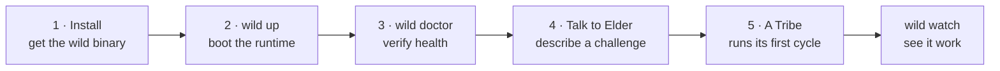
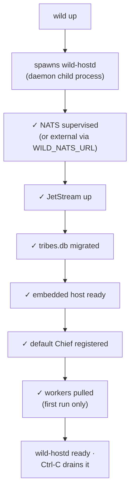

# Getting started

> From a clean machine to your first Tribe in five steps. This is the
> friendly path; every install option, knob, and troubleshooting note
> lives in [`installation.md`](installation.md), which this guide links
> into as you go.

You'll install the `wild` binary, boot the runtime, check it's
healthy, describe a challenge to **Elder**, and watch a **Tribe** take
it over.



---

## 1 · Install

Pick the path that fits your machine. The curl installer is the
quickest — it pulls the prebuilt binaries, verifies the checksum,
unpacks them into `~/.local/lib/wild` and symlinks `wild` into
`~/.local/bin`, which is already on `PATH` on most systems.

```bash
# macOS arm64/x86_64, Linux x86_64
curl -fsSL https://wildstuff.com/install | sh
```

Prefer Homebrew or building from source? Both are first-class:

```bash
brew install wildstuff/tap/wild           # custom tap
# — or build from source (any platform Rust supports) —
git clone https://github.com/wildstuff/the-wild && cd the-wild
cargo build -p wild-frontend -p wild-daemon --release
```

> 🔍 **Dig deeper — install paths & prereqs.**
>
> - All three paths, the installer's env knobs (`WILD_VERSION`,
>   `WILD_INSTALL_DIR`), supported targets, and prerequisites (NATS;
>   Docker only for a local build service): [`installation.md`](installation.md).
> - Homebrew tap details: `homebrew-tap-setup.md`.

---

## 2 · Boot the runtime — `wild up`

The runtime is headless by default. `wild up` spawns the long-lived
host (`wild-hostd`) as a child process, supervises it for the life of
the invocation, and drains it gracefully on Ctrl-C.

```bash
wild up
```

What happens on first boot:



First boot also materialises `<wild_root>/` — your profile, the OCI cache,
and a seed `bootstrap.yaml` that decides which plugins get pulled.
That tree is explained in [`inside-your-install.md`](inside-your-install.md).

`<wild_root>` is a real directory, just a different one per platform
(`~/Library/Application Support/Wild` on macOS, `~/.local/share/wild` on
Linux). You never have to type it: `wild doctor` prints the resolved path
for every file it checks. See
[`installation.md`](installation.md#where-your-files-actually-live).

> 🔍 **Dig deeper — boot & daemon.**
>
> - Keep the host alive across shell exit + reboots (the recommended
>   shape for ongoing use): [`operator-daemon.md`](operator-daemon.md).
> - What gets pulled at boot and how to pin it for reproducible
>   deploys: `bootstrap-and-default-inventory.md`.
> - Spawn the daemon detached so it keeps running for later `wild`
>   invocations to attach: `wild up --daemon`.

---

## 3 · Verify — `wild doctor`

From a second terminal, `wild doctor` walks every layer the runtime
touches and prints a pass/fail report. It doubles as "tell me what's
running."

```bash
wild doctor
# ✓ nats-server binary      …
# ✓ NATS @ nats://127.0.0.1:4222
# ✓ JetStream               ($JS.API.INFO ok)
# ✓ tribe-state KV          bucket present
# ✓ embedded runtime        host ready, 0 workloads
```

A hard failure (NATS unreachable, JetStream off) exits non-zero; soft
signals (nothing running yet) print a hint and exit zero.

---

## 4 · Connect an AI

Every conversation below runs through an LLM, so wire one up **before**
you talk to Elder. A fresh install seeds three `claude-cli-*` adapters
that drive the locally installed `claude` binary (Claude Code) — if you
have it, log in once and verify with a real call:

```bash
claude          # first run: log in, then quit
wild config llm test claude-cli-chat
# ✓ adapter `claude-cli-chat` responded in 812ms
```

No Claude on this machine? Point Wild at any OpenAI-compatible API
(Kimi/Moonshot, OpenAI, OpenRouter, vLLM, …) instead — store the key,
grant it, register the adapter, route the strategy slots:

```bash
wild secret add kimi                       # prompts for the API key
wild plugin grant openai --secret kimi
wild config llm add --kind component --slug openai --id kimi \
  --model kimi-k2-0711-preview \
  --endpoint https://api.moonshot.ai/v1/chat/completions
wild config llm bind-secret kimi api-key kimi
wild config llm strategy chat kimi         # repeat for logic + reasoning
wild config llm test kimi
```

The macOS app does all of this in its first-run Welcome dialog — the
commands above are the terminal path. `wild doctor` shows whether the
`claude` binary was found; only the test call proves the login.

> 🔍 **Dig deeper — adapters & routing.**
>
> - Adapter model, YAML schema, per-strategy routing:
>   `llm-adapters.md` ·
>   `llm-turn-strategies.md`.
> - How secrets are stored and granted: [`secrets.md`](secrets.md).

---

## 5 · Talk to Elder

Run `wild` with no subcommand for an inline chat REPL (native
scrollback, selection, Cmd-C):

```bash
wild
# → "What's your challenge?"
```

You're now talking to **Elder** — the one-per-install gatekeeper.
Describe something you want handled on an ongoing basis; Elder asks
the clarifying questions, then offers to spawn a Tribe.

```
> I want to monitor competitor pricing weekly and alert me when
  something changes by more than 5%.

Elder: That sounds like a recurring crawl-and-diff job. Before I spawn
  a tribe — which competitors? Listed prices, or do we need to handle
  login/quote forms? And where should the alert go: email, Slack, file,
  an MCP callback?
```

When you confirm, a fresh Tribe materialises and its Chief runs the
first cycle. From then on the Tribe is the addressee — switch the
conversation to it with `/tribe <id>`.

> 🔍 **Dig deeper — Elder & the conversation.**
>
> - What Elder is and how a vague idea becomes a running Tribe:
>   [`how-tribes-live.md`](how-tribes-live.md) · `elder.md`.
> - Talk to Wild from Claude Desktop / Cursor over MCP instead of the
>   terminal: [`mcp-setup.md`](mcp-setup.md).

---

## 6 · Watch it work — `wild watch`

For live multi-Tribe monitoring (Activity · Tribes · Bus panes), open
the watch console in another tab:

```bash
wild watch
```

Or wire the watch console into the same terminal as the runtime with
`wild up --watch`.

> 🔍 **Dig deeper — the surfaces.**
>
> - The full CLI surface (every verb + flag, `--json` everywhere):
>   [`cli.md`](cli.md).
> - The three observability surfaces (bus · daemon log · watch):
>   `observability.md`.

---

## Where to next

- [`how-tribes-live.md`](how-tribes-live.md) — how your Tribe works,
  learns, stores data, and evolves from here.
- [`inside-your-install.md`](inside-your-install.md) — what lives in
  `<wild_root>/` and what you can tune.
- [`dogfood-walkthrough.md`](dogfood-walkthrough.md) — a deeper, end-to-end
  first-Tribe walkthrough.
- `llm-adapters.md` — point Wild at the LLM provider
  you want.
