# How a Tribe Lives

> The third companion to the [README](../README.md) and
> [`idea.md`](idea.md). The README is the 60-second pitch.
> `idea.md` is the *why*. **This doc is the life-story**: what a
> Tribe actually does between your messages — how it **works**,
> how it **remembers and learns**, how it **stores and structures
> what it knows**, and how it **grows new abilities for itself**.
>
> Every diagram here is either a Mermaid block (renders to an
> image straight from this file) or carries a 🎨 **image prompt**
> you can feed to an illustration tool. The full prompt set is
> collected in [§ Generating the illustrations](#generating-the-illustrations).
>
> Two kinds of side-note punctuate the text: 🎨 **image prompts**
> (illustration briefs) and 🔍 **dig-deeper** boxes that link each
> concept to its design docs, ADRs, and the **exact config files**
> that control it. Read the prose for the picture; follow a 🔍 box
> when you want to verify or tune something. The complete config
> map is gathered in
> [§ Configuration — every file that shapes a Tribe](#configuration--every-file-that-shapes-a-tribe),
> and every term is in the [§ Glossary](#glossary).

---

## The shift, in one picture

Most software is a frozen artefact. You specify what it should do,
ship it, and it slowly drifts away from a world that keeps moving.
The Wild flips the direction: you describe a *challenge*, and the
runtime raises a **Tribe** that owns the topic and keeps growing
into it.

A Tribe is not a program you start and stop. It is a small
community that **works**, **remembers**, **structures what it
learns into data**, and **forges new abilities for itself** —
day after day, between your messages.

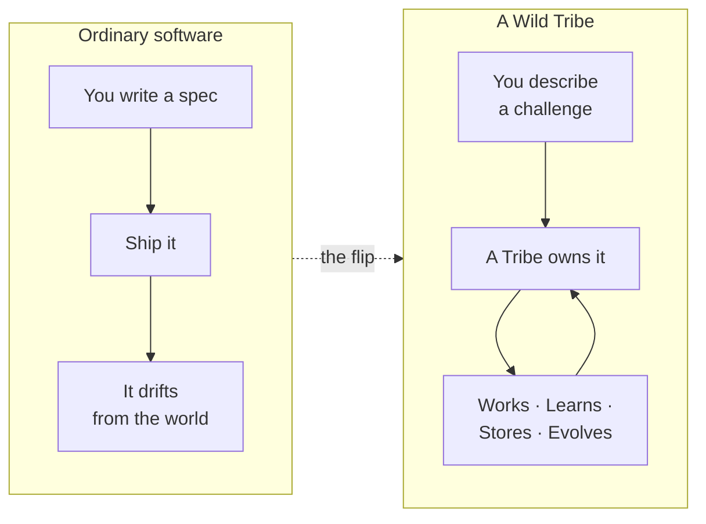

This document walks the four verbs in order — **Work → Remember →
Structure → Evolve** — and ends with one continuous story that
threads all four through a single Tribe.

<a href="diagrams/how-tribes-live/scenes/01-the-shift.svg">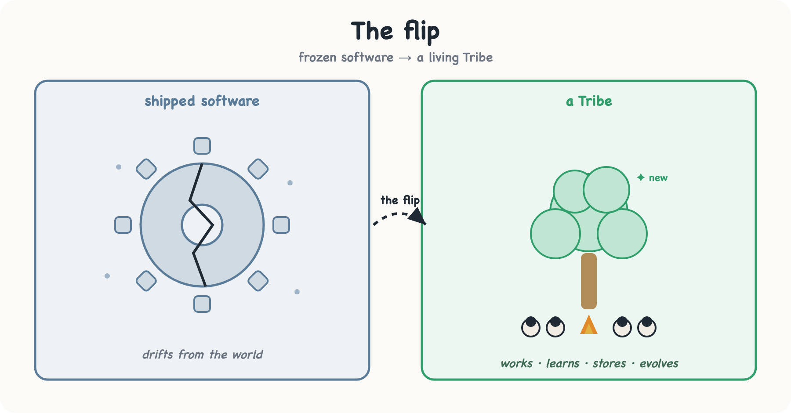</a>

*Editable mockup — [tune the SVG](diagrams/how-tribes-live/scenes/01-the-shift.svg), or generate a richer version from this prompt:*

> 🎨 **Hero image.** *Split illustration. Left half, cold blue,
> a cracked statue of a gear frozen mid-turn, dust settling —
> labelled "shipped software." Right half, warm green, a living
> campfire circle of small stylised figures (a robed elder, a
> chief with a staff, three workers, a glowing forge-anvil) under
> a tree that is visibly growing new branches — labelled "a
> Tribe." A dotted arrow crosses the seam, captioned "the flip."
> Flat editorial vector style, hand-drawn Excalidraw feel.*

---

## The cast (30-second recap)

If you've read the README these are familiar. The **bold-italic**
ones are the players this document leans on hardest.

| Noun | One line |
|---|---|
| **Elder** | Exactly one per install. The gatekeeper you talk to. Onboards new Tribes, routes you between them, operates them on your behalf. |
| ***Tribe*** | The top-level unit. A clan with its own bus prefix (`wild.{tribe}.…`), storage, secrets, and forge. Isolated from every other Tribe. |
| ***Chief*** | Exactly one per Tribe. Reads the Tribe's charter, runs **cycles**, dispatches workers, decides what to do next. |
| **Worker** | Many per Tribe. The specialists that do the actual work — a Crawler, an Analyst, a Writer. The rarest ones are **forged**: a specialist the topic demanded and nobody shipped. |
| ***Forge*** | One per Tribe. The smithy where the Tribe builds *new tools — and new workers — for itself* when the Chief notices a gap. |
| ***Ontology*** | The Tribe's living data model — the entities it tracks and how they relate. New in the data-membrane layer. |
| ***Judge*** | The honest scorer at the end of every loop. Did the work meet its declared success criterion? Its verdict is what tells the Tribe to stop or try again. |

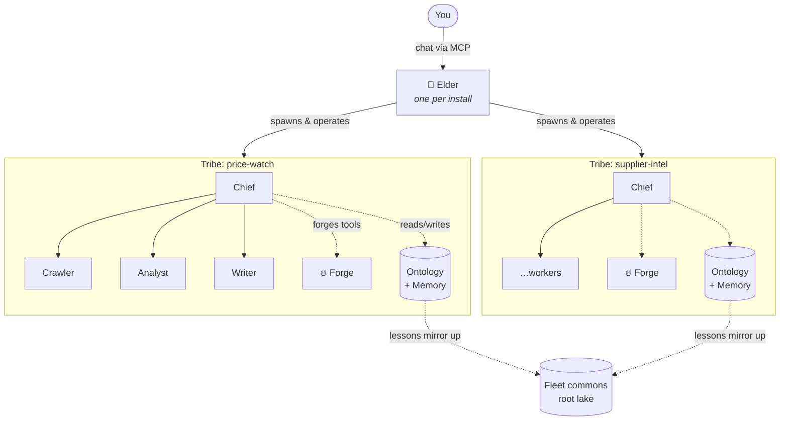

Tribes are *isolated*: a Tribe's data and working memory are its
own — what one holds, another never sees, and cross-Tribe questions
route through the Elder, never directly. The one carefully-scoped
exception is the **fleet commons**: the distilled *lessons* (what
scored well on a goal-shape, what failed on a capability) are
mirrored **read-only** into the root lake, so a new Tribe can start
on the fleet's hard-won experience instead of from zero.

---

## The life of a Tribe

Before a Tribe can work, it has to be *born* — and birth is cheap.
A Tribe begins life as an **idea**, which in The Wild is literally
just a **dormant Tribe**: a charter on disk, no workers running,
no cost. There is no separate "idea" object to convert later; the
idea *is* the Tribe, asleep.

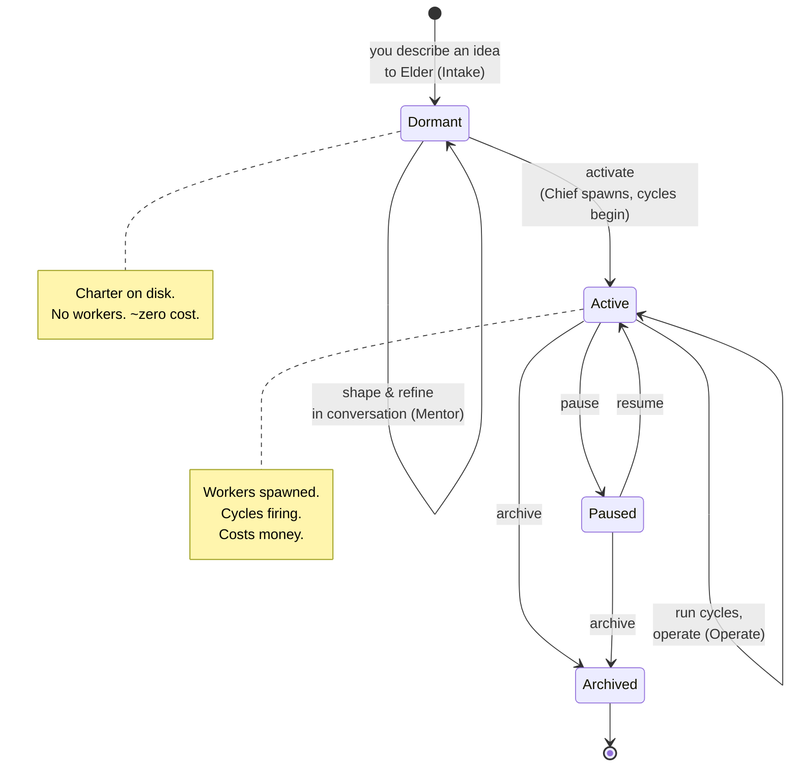

- **Dormant** — the idea lives as a charter (`specs/sketch.md`)
  and costs nothing to keep. You and Elder can shape it for as
  long as you like before committing.
- **Activate** — you say "let's run this." The Chief spawns, the
  workers instantiate, the Tribe subscribes to its slice of the
  bus, and the first cycle fires. *This* is where cost begins.
- **Pause / Archive** — freeze a running Tribe (it remembers its
  state) or retire it. Both drop back to ~zero cost; the Tribe's
  data stays on disk and can be resurrected.

The crucial idea: **the conversation is free, the Tribe is the
artefact.** You never touch YAML, never hand-write a worker. You
talk to Elder, and the charter is what gets written.

<a href="diagrams/how-tribes-live/scenes/02-lifecycle.svg">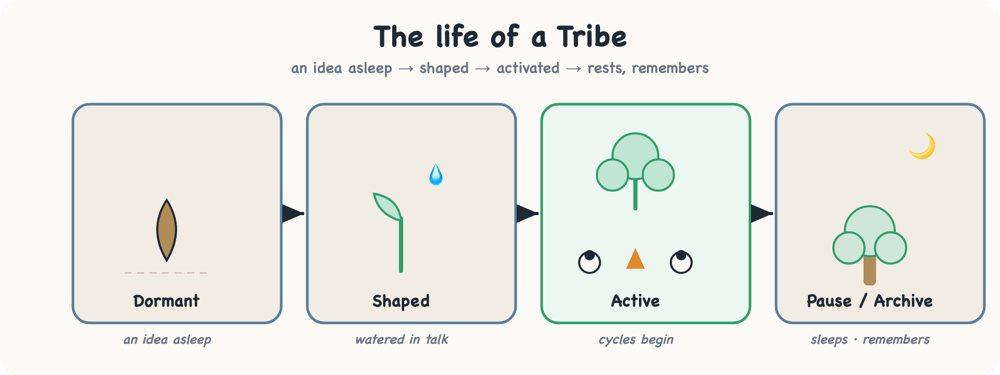</a>

*Editable mockup — [tune the SVG](diagrams/how-tribes-live/scenes/02-lifecycle.svg), or generate a richer version from this prompt:*

> 🎨 **Lifecycle image.** *A horizontal "growth strip" like a
> plant-growth chart. Stage 1: a seed in soil labelled "Dormant
> — an idea asleep." Stage 2: same seed, a hand watering it,
> labelled "shaped in conversation." Stage 3: a sprout with a
> small campfire and figures appearing, labelled "Activate —
> cycles begin." Stage 4: a full small tree with a moon over it,
> labelled "Pause / Archive — sleeps, remembers." Warm earthy
> palette, Excalidraw hand-drawn style.*

> 🔍 **Dig deeper — the lifecycle.**
>
> - **Concept:** ADR-0042 · Idea = dormant tribe · ADR-0031 · pin → activate · ADR-0023 · the Idea Spine · ADR-0008 · explorer-first.
> - **On disk:** an idea and an activated Tribe are the same folder — `tribes/<slug>/`, the idea carrying `status: dormant` and a `specs/sketch.md` (ADR-0042: there is no separate `ideas/` tree). Its charter is `blueprint.md` + `specs/*.md`, its roster is `workers/<slug>.yaml`, its memory of decisions is `decisions/`. The exhaustive file map is `profile-layout.md`.
> - **How much of your specs the Elder carries per turn.** Your `specs/*.md` are read into every Elder turn about that Tribe, and that reading has a fixed size. Files are taken whole, in name order, until the space runs out; whatever is left is named in the turn rather than dropped in silence, so the Elder never answers as if it had read a mission it was not given. If your first file alone is larger than the space, its opening is carried and the cut is said out loud. **Practical consequence: keep the mission short and put it in the first file by name.** The Elder is told, in the same breath, that it has NOT been given the rest, so it will say so rather than answer as if it had. There is no door today that fetches one spec on demand — if you need a file the turn did not get, shorten the bundle or put that file first. **This limit is only about the Elder's reading.** Your Tribe's own Chief still receives the whole bundle as its blueprint every cycle, so a long mission keeps driving the work in full; what it no longer does is crowd out the Elder's own guidance in a conversation about that Tribe. Why there is a limit at all: ADR-0300 D3 — before it, a long spec bundle silently crowded out the Elder's own guidance, so the more you documented your Tribe, the less the Elder knew how to help with it.

---

## How a Tribe **works**

A running Tribe does everything in **cycles**. A cycle is one
"turn of the wheel": the Chief wakes, reads its state, reasons
about what to do, dispatches workers, records what happened, and
goes back to sleep until something wakes it again.

### What wakes a cycle

| Trigger | Meaning |
|---|---|
| **Schedule** | A clock. "Every Monday 08:00", "every 6 hours." |
| **Result** | A worker finished — fire the next step. |
| **User** | You asked the Tribe a question. |
| **Alarm** | The Tribe set its own reminder for later. |
| **Heartbeat** | A periodic health/status check-in. |

These are the everyday ones; the runtime also has specialist triggers
(boot, reflect, evolve, reboot, …) for internal cycle types — see
ADR-0027.

### What happens inside one cycle

The cycle is not a fixed script — it **adapts its depth to the
task**. A short status ping gets a few turns; an open-ended
research task gets fifteen or twenty. Before anything risky or
irreversible, the Chief stops to critique itself first.

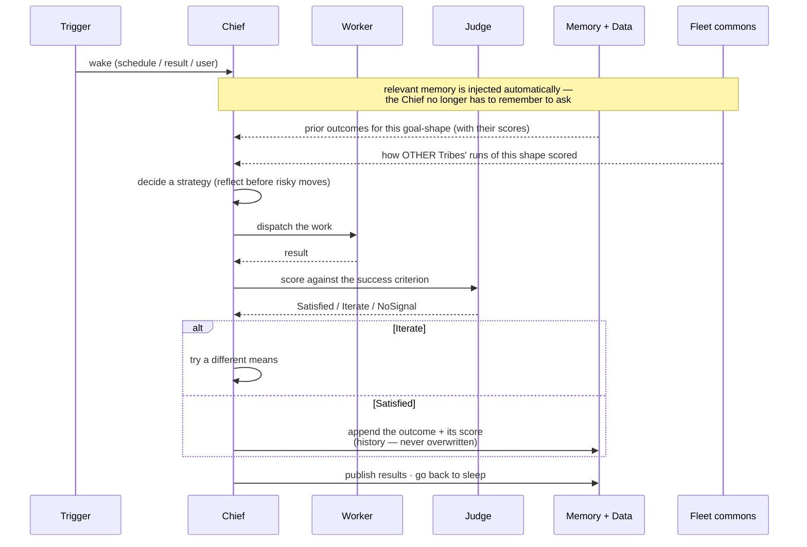

### The one loop

Underneath every cycle — whether the Tribe is chasing its mission
*or* improving itself — runs **one single movement**:

> **Goal → Recall → Strategy → Decide → Assemble → Run → Judge →
> Learn → Iterate.**

The load-bearing piece is the **Judge**. Every goal carries an
*observable success criterion* (declared in the Tribe's spec), and
the Judge scores the result against it. That verdict is the
loop's stop-or-continue signal:

- **Satisfied** — good enough. Stop, record what worked.
- **Iterate** — below the bar. Try a different means.
- **No signal** — nothing observable to score. Ask the operator
  once; *never spin in place.*

This is why a Tribe doesn't get stuck in endless loops or quietly
waste cycles: there is always an honest signal telling it whether
it is done. The same loop runs in two modes — `target = mission`
(do the job) and `target = self` (get better at the job) — so
self-improvement is not a second machine, it's the same wheel
pointed inward.

<a href="diagrams/how-tribes-live/scenes/03-the-loop.svg">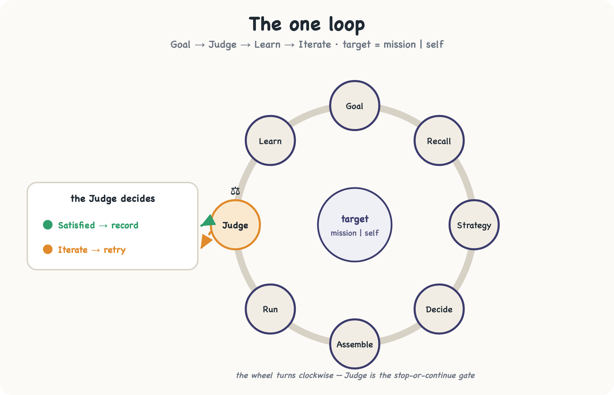</a>

*Editable mockup — [tune the SVG](diagrams/how-tribes-live/scenes/03-the-loop.svg), or generate a richer version from this prompt:*

> 🎨 **The loop image.** *A circular conveyor / waterwheel diagram.
> Eight stations around the rim labelled Goal, Recall, Strategy,
> Decide, Assemble, Run, Judge, Learn — with the wheel's flow
> arrows going clockwise. At the "Judge" station, a set of
> balance-scales sits prominently, with two exit chutes: a green
> one looping back to the top labelled "Satisfied → record," and a
> red one looping back to "Strategy" labelled "Iterate → retry."
> A small inner arrow shows the wheel can point at "mission" or
> "self." Clean schematic, Excalidraw style.*

> 🔍 **Dig deeper — cycles and the one loop.**
>
> - **The cycle that adapts its depth:** ADR-0027 · adaptive cycle loop. **The one loop and the Judge:** ADR-0049 · agentic goal-pursuit. **When a fixed schedule compiles to a deterministic recipe and skips the LLM:** ADR-0039 · `cycle-schedules.md`.
> - **Which model runs each step:** every call site is routed Chat / Logic / Reasoning — `llm-turn-strategies.md`.
> - **On disk:** a Tribe's workers and schedules live in `tribes/<slug>/workers/<slug>.yaml` and `tribes/<slug>/alarms/<name>.yaml`; every cycle's turns are recorded in `tribes/<slug>/runs/*.jsonl` + `traces/*.jsonl`. Turn caps and token budgets: [`config-vars.md`](config-vars.md).

---

## How a Tribe **remembers and learns**

A Tribe that re-read its entire charter every cycle would never
get smarter. Instead, every Tribe is **born with a memory of
itself** — and it writes to that memory as it works.

### Self-modeling: relational self-knowledge

At birth a Tribe is seeded with two memory types:

- **`learning`** — a structured note: *what happened, why it
  mattered, which capability it was about, how severe.* Not prose
  buried in a file — a queryable record.
- **`capability`** — an anchor the learnings hang off, so the
  Tribe can ask *"what do I know about my crawling ability?"* and
  get every relevant lesson back at once.

The flow is a tight loop the Chief runs while it works:

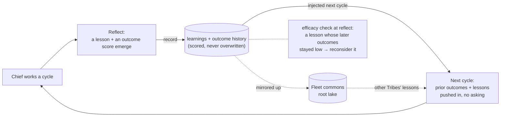

Instead of re-reading fifty brief files, the Chief asks its memory
a *relational* question — "what have I learned about this
capability?" or "have I solved a goal of this **shape** before?" —
and steers the next attempt with the answer. Learnings are keyed
by the **shape** of the goal, not its exact wording, so two runs
of the same kind of problem recall each other even when the words
differ.

By default that shape-matching is **exact**. You can optionally make
it *semantic* — surfacing lessons from **similar** situations, not
just identically-shaped ones, and letting the Elder draw on what the
whole fleet has already learned about adjacent problems — by enabling
a local embedding model. It stays off until you opt in, runs
fully on your own machine at zero cost, and recall simply falls back
to exact-shape matching without it (see the box below).

### The Judge is also the learning signal

The same Judge that ends a cycle (Satisfied / Iterate) is what
makes learning honest. Every outcome is recorded with *its score* —
as **history**, one row per attempt, never overwritten — so the
Tribe keeps the whole trajectory (`0.65 → 0.80 → 1.00`), not just a
final number. Over time it accumulates not just "what I did" but
"what I did **that worked**", and a rising trajectory is the proof
that its self-changes are actually helping.

Two things make that memory work harder than a private notebook:

- **It's pushed, not pulled.** The relevant prior outcomes and
  capability lessons are *injected into the prompt automatically* at
  the moment they matter — at dispatch, on a scored result, at
  reflect — so the Chief reasons over recalled evidence instead of
  having to remember to look it up.
- **It's shared, and it's falsifiable.** Distilled lessons mirror
  up into the **fleet commons** (the root lake), so one Tribe's
  hard-won failure-mode warns every other Tribe that uses the same
  capability. And at reflect the Tribe gets an **efficacy** check:
  a lesson whose later outcomes stayed low is surfaced as a
  *reconsideration candidate* — wrong knowledge is allowed to die
  rather than calcify.

<a href="diagrams/how-tribes-live/scenes/04-memory.svg">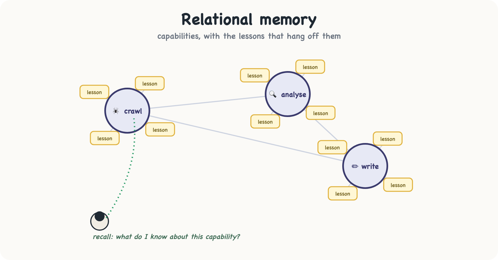</a>

*Editable mockup — [tune the SVG](diagrams/how-tribes-live/scenes/04-memory.svg), or generate a richer version from this prompt:*

> 🎨 **Memory image.** *A stylised brain-as-constellation: glowing
> nodes connected by lines. A few large hub-nodes are labelled
> with capability icons (a spider for "crawl," a magnifier for
> "analyse," a pen for "write"). Smaller satellite nodes around
> each hub are "lessons," each a tiny sticky-note. A robed Chief
> figure stands below, pulling a glowing thread from the "crawl"
> hub — captioned "recall: what do I know about this?" Deep-indigo
> night palette with warm node glows, Excalidraw style.*

> 🔍 **Dig deeper — how learning works.**
>
> - **Concept:** [`self-modeling.md`](self-modeling.md) (the relational learning layer in full) · ADR-0049 · F4 (outcome recall keyed on goal-shape, not free text) · ADR-0058 · knowledge commons + outcome history (attempt-keyed history, the deterministic recall-injection points, the fleet commons, learning-efficacy) · ADR-0034 (the dogfood origin: the Tribe eats its own data layer).
> - **Toggle:** `WILD_SELF_MODELING` (default on) — [`config-vars.md`](config-vars.md).
> - **Optional — semantic recall:** run a local embedding model to match *similar* goal-shapes (and tap the fleet-wide knowledge commons), zero-cost on your own machine — [`installation.md` § Optional: sharpen recall](installation.md#optional-sharpen-recall-with-local-embeddings). Off by default; recall falls back to exact-shape matching without it.
> - **On disk:** the born-with `learning` and `capability` types are real `wild:data` types; their human-readable render is `tribes/<slug>/types/<type>/schema.generated.yaml` (the source of truth is the event log the daemon keeps for the Tribe, not that file).

---

## How a Tribe **stores and structures data**

Working and remembering are about *behaviour*. But many Tribes
also need to **hold a body of knowledge** — prices over time,
suppliers, invoices, documents — and answer exact questions about
it. That is the **data membrane**, and its defining choice is
**model-first**.

### Model-first: declare the shape before the data arrives

A Tribe is born with an **ontology** — a declared model of the
entities it will track — even before it has ingested a single row.
Like a librarian who sets up the catalogue *before* the books
arrive. "I track Products, Price-Snapshots, and Suppliers" is
declared up front; sources are then mapped *into* that model. The
payoff: the Tribe's knowledge is queryable from day one, and every
answer is auditable back to its source.

### The three medallion layers

Data flows through three tiers — a pattern borrowed from data
engineering, but made concrete and tool-free for a Tribe.

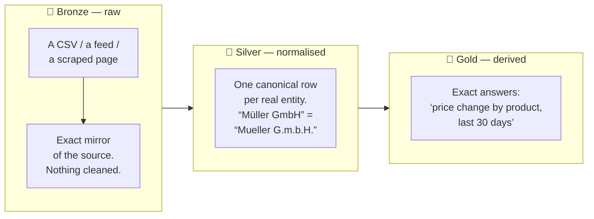

- **🥉 Bronze — the raw mirror.** The source exactly as it
  arrived. No cleaning, no inference. This is the audit anchor:
  *"prove the number came from the official source."*
- **🥈 Silver — the real entities.** Raw data repeats itself —
  every price row names the same product again. Silver extracts
  **one canonical row per entity**, merging spelling variants
  ("Müller GmbH" and "Mueller G.m.b.H." are the same supplier) so
  the Tribe can reason about *things*, not rows.
- **🥇 Gold — the answers.** Aggregations computed over a date
  window: "total price drift this quarter by product." These use
  **exact decimal arithmetic** — no floating-point rounding, no
  LLM guessing at sums. The math is deterministic and the result
  carries its **lineage**: which sources fed it, and whether any
  have drifted since.

### Onboarding: turning a source into knowledge

You don't load data by hand. You point the Tribe at a source and
it runs an **intake chain** — a governed pipeline from raw bytes
to queryable structure:

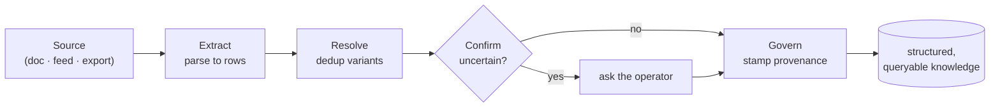

Every record that lands carries its **provenance** — which blob it
came from, which extractor version, which page. That link is a
**walkable graph edge** (`derived_from`), not just a stored field,
so the lineage drill-down below can hop from a confirmed record
straight back to the source document. And because the Tribe
recognises a source it has seen before (by the *shape* of its
columns), the second invoice from the same vendor reuses the
mapping it learned from the first.

### Asking questions across the graph

Once entities are pinned and related, the Tribe can **traverse**
its own knowledge like a graph — "from this Supplier, follow
`supplies` to its Products, sum the price drift" — without anyone
writing SQL. The schema enforces which edges are even walkable, so
the answers stay type-safe and exact.

<a href="diagrams/how-tribes-live/scenes/05-medallion.svg">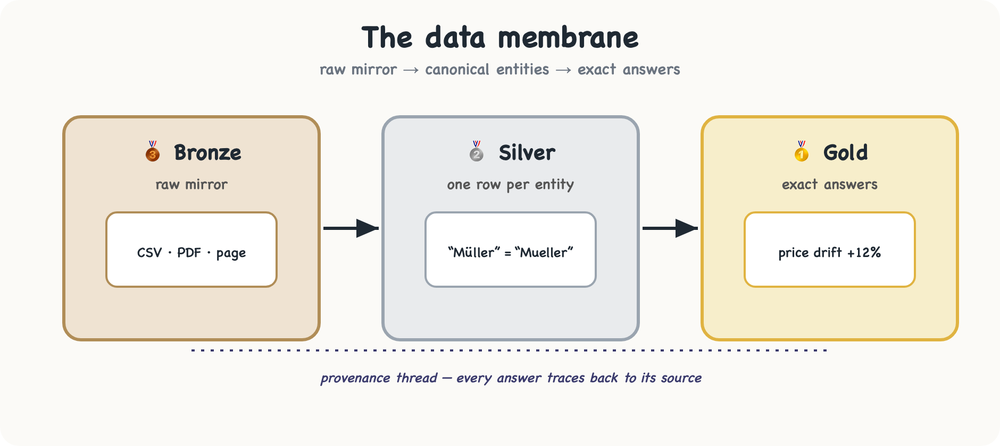</a>

*Editable mockup — [tune the SVG](diagrams/how-tribes-live/scenes/05-medallion.svg), or generate a richer version from this prompt:*

> 🎨 **Medallion image.** *Three stacked refinery vats connected by
> pipes, left to right. Vat 1 (bronze-coloured) labelled "raw" —
> chaotic mixed shapes pouring in (a CSV icon, a PDF, a webpage).
> Vat 2 (silver) labelled "entities" — the shapes have merged into
> a few clean, identical crystals. Vat 3 (gold) labelled "answers"
> — a single glowing gauge/dashboard reading "+12%". A thin
> "provenance" thread runs along the bottom connecting the final
> gauge all the way back to the raw inputs. Industrial-but-friendly
> Excalidraw style, metallic accent colours.*

> 🔍 **Dig deeper — the data membrane.**
>
> - **Concept:** `intake-pipeline-conventions.md` (the Extract → Resolve → Confirm → Govern intake chain) · ADR-0034 · spec-driven tribes · the `wild:data` contract itself, [`wit/data/data.wit`](../wit/data/data.wit).
> - **Drive it yourself:** the `wild data` CLI (`type apply`, `ingest`, `query`) — see [`cli.md`](cli.md).
> - **On disk:** every pinned type is a folder `tribes/<slug>/types/<type_slug>/` — `index.yaml` (editable: which vector fields are indexed) and `schema.generated.yaml` (read-only render). The medallion shows up as the type's `origin` (`type-origin` ∈ `authored` · `source-mirror` · `derived`): Bronze is `source-mirror`, Silver is `derived` + a `normalize` rule, Gold is `derived` + a host-side `view`.

---

## How a Tribe **evolves**

Here is the property that makes a Tribe genuinely *living*: it does
not stay limited to the abilities it shipped with. It grows three
ways.

### 1. It forges its own tools

When the Chief hits a wall — *"I need a tool that renders
JavaScript pages and I don't have one"* — it walks to the **Forge**
with a specification. The Forge asks the LLM for Rust source
(against a strict crate allowlist), builds it inside a sandboxed
container into a WebAssembly component, pins it by content hash, and
the host installs it as a plugin (behind an approval gate). Next
cycle, the tool exists. **You did nothing.**

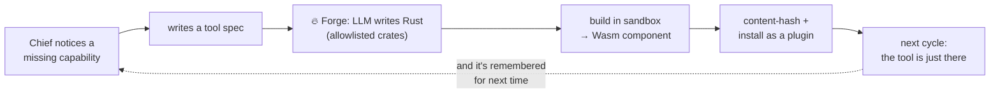

Strict guardrails apply: only `tool-provider` and `workload`
flavors are forge-buildable — a Tribe can never forge itself new
filesystem or network *adapters*. The generative power is real but
fenced.

### 2. It earns autonomy by proving quality

A new Tribe asks before doing anything consequential. As it builds
a track record, it can **graduate** to handling routine, recoverable
decisions on its own — but only on *quality terms*.

- The operator (never the Tribe itself) holds the autonomy
  settings. A Tribe **cannot graduate itself**.
- Only **recoverable, medium-risk** actions can ever go autonomous.
  Irreversible ones — deploying, changing the charter, migrating
  the schema — **always** ask, no exceptions.
- Graduation is **gated on the Judge's quality score**, not just
  on "you approved it ten times." A Tribe that was rubber-stamped
  but mediocre never buys more independence — a quality floor
  blocks it. The system can *propose* a graduation; the operator
  decides.
- Trust is **revocable, and demotion ships before promotion**. If a
  graduated rule's quality later collapses, the host **demotes it
  back to propose-only and quarantines it** — the rule can't simply
  re-graduate itself; releasing a quarantined rule is an operator
  act. Earned autonomy is a standing verdict the evidence keeps
  having to support, not a one-time badge. (The autonomy history —
  every graduate and quarantine — is itself recorded, so at reflect
  the Tribe sees *why* a rule reverted and can work to earn it back.)

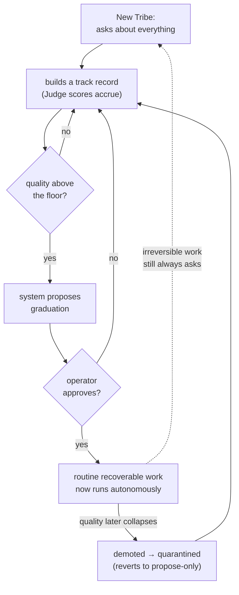

### 3. It assesses and closes its own gaps

A Tribe periodically measures itself against its ratified goals:
*Are all the data sources I need actually onboarded? Do I have the
capabilities my mission requires? Is my output correct?* These
checks are **deterministic** — set differences, balance
invariants — not an LLM freely deciding "I'm fine." Where it finds
a gap it can close safely (onboard a missing source, forge a
worker within budget), it acts; where it can't, it surfaces the
gap rather than pretending to be done. **A "complete" claim is
always provable against the bar, never a bare "done."**

<a href="diagrams/how-tribes-live/scenes/06-evolve.svg">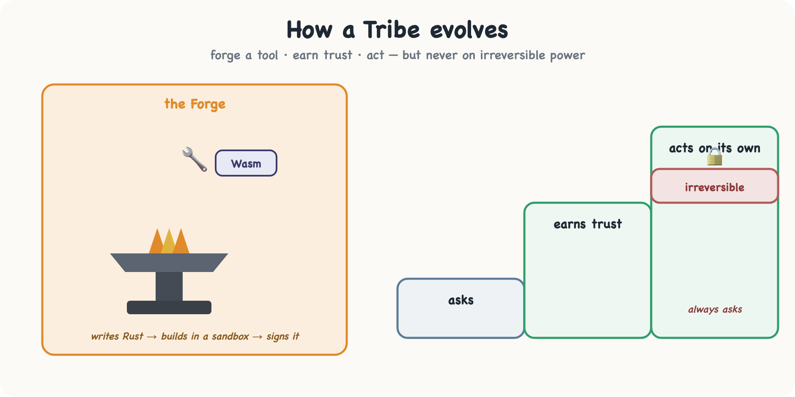</a>

*Editable mockup — [tune the SVG](diagrams/how-tribes-live/scenes/06-evolve.svg), or generate a richer version from this prompt:*

> 🎨 **Evolution image.** *A blacksmith scene reimagined for a
> Tribe. A glowing anvil at centre; a Chief figure pulls a
> brand-new tool (a tiny stylised wrench with a "Wasm" hex-stamp)
> out of the fire. Around the forge, three rising steps like a
> staircase labelled "asks · earns trust · acts on its own," with
> a locked gate on the top step labelled "irreversible — always
> asks." Embers drifting upward. Warm forge-orange against cool
> dusk, Excalidraw hand-drawn style.*

> 🔍 **Dig deeper — forging, trust, and autonomy.**
>
> - **The Forge:** `forge/README.md` (the sandboxed build pipeline) · [`plugin-concept.md`](plugin-concept.md) (three tiers, five flavors) · [`skill-vs-tool.md`](skill-vs-tool.md) (what a Forge produces) · [`plugin-trust.md`](plugin-trust.md) (trust tiers). **Why only `tool-provider` / `workload` are forge-buildable:** ADR-0012; output provenance ADR-0037; autonomous forge ADR-0046.
> - **Earning autonomy:** ADR-0048 · autonomy graduation (the quality floor) · ADR-0057 · closed-loop graduation (demote-first + quarantine + the operator-intent / host-written file split) · ADR-0018 · autonomy policy. **Closing its own gaps:** ADR-0052 · self-development loop.
> - **Config:** extra crates the Forge may pull → `forge/allowlist.toml` (then `wild forge allowlist sync`). Which routine, recoverable decisions a Tribe may take on its own → `system/autonomy.yaml` (operator-edited, never written by the Tribe).

---

## How **you** steer it

For all this autonomy, you never lose the wheel. You stay in your
normal AI surface — Claude Desktop, Claude Code, any MCP-aware
client — and **Elder** is the one fixed point it talks to.

Elder works in three modes from a single conversation:

| Mode | You're doing… | Example |
|---|---|---|
| **Intake** | Onboarding a brand-new Tribe | *"Build me something that watches competitor pricing."* |
| **Mentor** | Shaping or stewarding an existing Tribe | *"For the price-watch tribe, only alert on drops over 5%."* |
| **Operate** | Changing a running Tribe | *"Add an earnings-call source. Pause the writer."* |

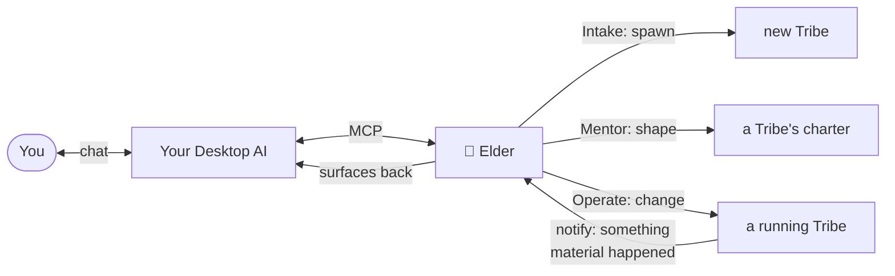

From your seat the only artefact that ever appears is *"Elder
built / changed / observed something"* — back through MCP, back
through your AI, back to you. The default posture is conservative:
the Tribe asks before anything that matters, and you decide how
much rope to give it as trust accrues.

> 🔍 **Dig deeper — Elder and how you connect.**
>
> - **Concept:** `elder.md` (the Intake / Mentor dialogue) · ADR-0040 · agentic runner (the per-mode tool catalogs) · ADR-0022 · reasoning loops · ADR-0044 · operator channels (MCP today, Telegram next) · ADR-0029 · MCP as primary UI.
> - **Connect your client:** [`mcp-setup.md`](mcp-setup.md).
> - **Config:** Elder's persona / tone / org context → `ELDER.md`; which external servers are reachable → `mcp-servers.yaml`; which model Elder reasons with → `llm-adapters.yaml`. Caps and flags: [`config-vars.md`](config-vars.md).

---

## The whole story, end to end

Here is one Tribe living through all four verbs at once.

**Day 0 — born (dormant).** You tell Elder: *"Keep an eye on three
competitors' pricing pages and tell me when something material
moves."* Elder asks where to send alerts, how often to check,
whether the pages need login. It writes a charter. The Tribe
exists, asleep, costing nothing.

**Day 1 — activated, working.** You say go. The Chief spawns a
**Crawler**, an **Analyst**, and a **Writer**. The first cycle
runs: three pages fetched, no change, the Writer stays quiet. The
Chief sleeps until next Monday.

**Week 2 — structuring data.** The Tribe starts keeping the prices,
not just diffing them. Each scrape lands in **Bronze** raw; the
**Silver** layer collapses "Pro Plan", "Pro tier", and "PRO" into
one canonical product; a **Gold** view now answers *"price drift
by product, last 30 days"* with an exact figure and a provenance
trail. The competitor's prices have become *queryable knowledge*.

**Week 3 — evolving.** The second competitor switches to a
JavaScript-rendered widget. The Crawler returns empty HTML. The
Chief reflects: *"I'm missing a tool — I need to render JS."* It
walks to the **Forge**; twenty seconds later a
`headless-render-fetcher` exists and the next cycle is back to
work. You did nothing.

**Week 4 — learning.** The Chief notices the render failures
clustered at dawn, when that site A/B-tests its layout. It
**records the learning**, linked to its crawl capability. The next
time crawling gets flaky, it **recalls** the lesson and reaches
straight for the render-fetcher instead of failing first.

**Month 2 — earning autonomy.** The Tribe has scored well, cycle
after cycle. The system **suggests** it can categorise routine
price moves without asking each time. You approve — for the
recoverable stuff. Material drops still ping you. Months later, a
new conversation about *supplier* monitoring makes Elder surface
this Tribe as prior art: *"you did something structurally similar;
want to fork that approach? The render-fetcher would carry over."*

That is a Tribe that takes a topic over and grows.

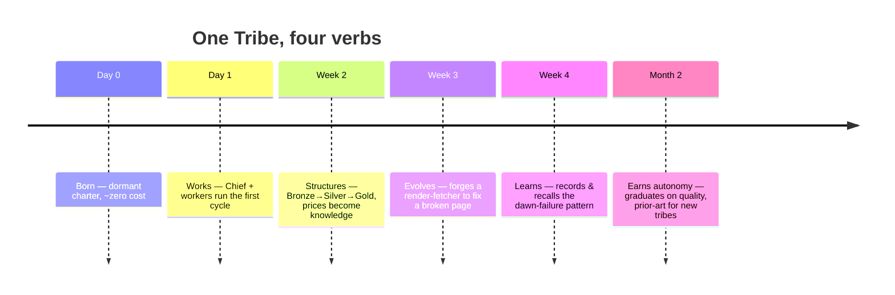

---

## Configuration — every file that shapes a Tribe

You configure The Wild by editing plain files in your profile
(`<profile_root>/`) — never a database, never a hidden
console. The rule is uniform: **a missing file means "use
defaults."** You can delete any optional file and the daemon still
boots. The canonical, exhaustive listing (who owns each file, who
reads it, when it reloads) is `profile-layout.md`;
the map below groups the same files by *what you'd want to tune*.

### Files you edit by hand

| To tune… | Edit | Details |
|---|---|---|
| Elder's persona, tone, organisation context, locale | `ELDER.md` | `elder.md` |
| Which LLM models run, and the Chat / Logic / Reasoning routing | `llm-adapters.yaml` | `llm-adapters.md` · `llm-turn-strategies.md` |
| Which external MCP servers a Tribe may reach | `mcp-servers.yaml` | [`mcp-setup.md`](mcp-setup.md) |
| Which on-disk CLI binaries the sandbox may spawn | `cli-binaries.yaml` | [`cli.md`](cli.md) · [`config-vars.md`](config-vars.md) |
| Per-plugin settings (overrides without touching manifests) | `plugin-config.yaml` | `plugin-config-yaml-schema.md` |
| Extra crates the Forge may compile against | `forge/allowlist.toml` | `forge/README.md` (then `wild forge allowlist sync`) |
| Which routine, recoverable decisions a Tribe may take autonomously | `system/autonomy.yaml` | ADR-0048 · ADR-0018 |
| The default plugin inventory pulled at first boot | `bootstrap.yaml` / `bootstrap.lock` | `bootstrap-and-default-inventory.md` |
| Secrets (keychain → env chain, ACL grants) | — (keychain + env) | [`secrets.md`](secrets.md) |
| Feature flags & toggles (incl. `WILD_SELF_MODELING`, `WILD_ELDER_MAX_TURNS`, `WILD_RBAC_ENABLED`) | environment | [`config-vars.md`](config-vars.md) — every `WILD_*` var, where it's read |

> **Why `system/autonomy.yaml` is the one exception under
> `system/`.** Everything else in `system/` is daemon-internal and
> off-limits, but autonomy is *operator authority* — so the Tribe
> can never write it. The Tribe may *suggest* a graduation; you
> apply it by hand-editing this file.

### State you inspect (and edit with care)

These are not "config" — they are the Tribe's canonical state on
disk (per ADR-0026). Read
them to see exactly what a Tribe is and knows; edit only
deliberately.

| Path | What's there |
|---|---|
| `tribes/<slug>/` | A Tribe: `blueprint.md`, `specs/*.md`, `CHIEF.md`, `workers/*.yaml`, `alarms/*.yaml`, `runs/*.jsonl`, `traces/*.jsonl`. A **pinned idea is the same folder** with `status: dormant` in `meta.yaml` and a `specs/sketch.md` — ADR-0042, no separate `ideas/` tree. |
| `tribes/<slug>/types/<type>/` | One `wild:data` type — its `schema.generated.yaml` render and editable `index.yaml`. |
| `decisions/<YYYY-MM>/DEC-*.md` | The audit trail: every consequential choice, with its rationale. |
| `sessions/SES-<hex>/` | A chat session with Elder: `meta.yaml` + append-only `messages.jsonl`. |

Tip: `wild up` regenerates a `PROFILE.md` snapshot of whatever
currently exists — the quickest way to see your install's actual
footprint.

---

## Glossary

Every load-bearing noun, with a one-line definition and a pointer
to where it's explained in full.

| Term | In one line | More |
|---|---|---|
| **Elder** | The one-per-install gatekeeper you talk to; onboards and operates Tribes. | [§ steer](#how-you-steer-it) · `elder.md` |
| **Tribe** | The top-level unit: an isolated clan with its own bus, storage, secrets, forge. | [`idea.md`](idea.md) |
| **Chief** | The one-per-Tribe orchestrator that runs cycles and dispatches workers. | [§ works](#how-a-tribe-works) |
| **Worker** | A specialist that does the actual task (Crawler, Analyst, Writer…) — shipped, installed, or forged by the Tribe itself. | [`plugin-concept.md`](plugin-concept.md) |
| **Forge** | The per-Tribe smithy that builds new tools for the Tribe in a sandbox. | [§ evolves](#how-a-tribe-evolves) · `forge/README.md` |
| **Blueprint / spec / sketch** | The Markdown charter a Tribe runs on; a dormant idea's is `specs/sketch.md`. | ADR-0034 · ADR-0042 |
| **Cycle** | One turn of the wheel: wake → reason → dispatch → record → sleep. | [§ works](#how-a-tribe-works) · ADR-0027 |
| **Trigger** | What wakes a cycle: schedule, result, user, alarm, heartbeat. | `cycle-schedules.md` |
| **The Judge** | Scores a result against its success criterion; its verdict stops or re-runs the loop. | [§ works](#how-a-tribe-works) · ADR-0049 |
| **`target = mission \| self`** | The one loop pointed outward (do the job) or inward (get better at it). | ADR-0049 |
| **Self-modeling** | A Tribe's relational memory of its own learnings, keyed by capability. | [§ learns](#how-a-tribe-remembers-and-learns) · [`self-modeling.md`](self-modeling.md) |
| **Ontology** | A Tribe's declared model of the entities it tracks (model-first). | [§ data](#how-a-tribe-stores-and-structures-data) |
| **Medallion (Bronze / Silver / Gold)** | Raw mirror → canonical entities → exact derived answers. | [§ data](#how-a-tribe-stores-and-structures-data) |
| **Intake chain** | Extract → Resolve → Confirm → Govern: how a source becomes queryable knowledge. | `intake-pipeline-conventions.md` |
| **Autonomy graduation** | Earning the right to act on routine, recoverable decisions — gated on quality. | [§ evolves](#how-a-tribe-evolves) · ADR-0048 |
| **Plugin** | Anything not hard-wired: three delivery tiers × five flavors, all sandboxed. | [`plugin-concept.md`](plugin-concept.md) |

---

## Where to go next

- [`idea.md`](idea.md) — the deeper *why* behind the model.
- [`architecture.md`](architecture.md) — the technical *how*:
  embedded host, NATS bus, WebAssembly sandbox, capability model.
- [`self-modeling.md`](self-modeling.md) — the learning layer in
  depth.
- `elder.md` — how Elder steers the
  conversation.
- `adr/0049-agentic-goal-pursuit-loop.md`
  — the one loop, `target = mission | self`, and the Judge.
- `adr/0048-autonomy-graduation.md`
  — earning independence on quality terms.
- `adr/0034-spec-driven-tribes.md`
  — the data/spec authoring lane.

---

## Generating the illustrations

> **All figures live as tunable source in
> [`diagrams/how-tribes-live/`](diagrams/how-tribes-live/).** Mermaid
> `.mmd` for the structural diagrams (this section's blocks), and an
> editable `.svg` + `.png` export + an AI prompt for each hero scene.
> Edit a source there, run `render.sh`, and the figures update. The
> folder's [README](diagrams/how-tribes-live/README.md) maps every
> file to its section here.

This document is built to be *illustrated*, two ways.

**1. The Mermaid blocks render directly.** Every ` ```mermaid `
block above is image source. GitHub renders them inline; to export
PNG/SVG, paste a block into the [Mermaid Live
Editor](https://mermaid.live) or run `mmdc -i how-tribes-live.md`
with the [mermaid-cli](https://github.com/mermaid-js/mermaid-cli).
They are the *structural* diagrams (loops, state machines, flows).

**2. The 🎨 prompts produce the hero scenes.** For the richer
editorial illustrations — matching the hand-drawn feel of
[`assets/wild-overview.png`](assets/) — feed the prompts below to
an image model, or use them as a brief for an Excalidraw artist.
A shared style suffix keeps the set coherent:

> *Style: flat editorial vector illustration, hand-drawn
> Excalidraw feel, warm and approachable, limited palette, generous
> whitespace, legible hand-lettered labels. No photorealism.*

| # | Section | Scene |
|---|---|---|
| 1 | The shift | Cracked frozen gear (blue) vs living campfire-circle Tribe under a growing tree (green), dotted "the flip" arrow. |
| 2 | Life of a Tribe | Plant-growth strip: seed asleep → watered → sprout with campfire → small tree under a moon (dormant→shaped→active→paused). |
| 3 | How it works | Waterwheel of eight stations; balance-scales at "Judge" with green "Satisfied" and red "Iterate" chutes; inner mission/self arrow. |
| 4 | Remember & learn | Brain-as-constellation; capability hub-nodes with lesson satellites; a Chief pulling a glowing recall-thread. |
| 5 | Store data | Three refinery vats — raw (bronze) → merged crystals (silver) → glowing gauge (gold) — with a provenance thread along the bottom. |
| 6 | Evolve | Blacksmith forge pulling a Wasm-stamped tool from the fire; a three-step trust staircase with a locked "irreversible" gate on top. |

Keep this table in sync if you add or move a 🎨 prompt above.
