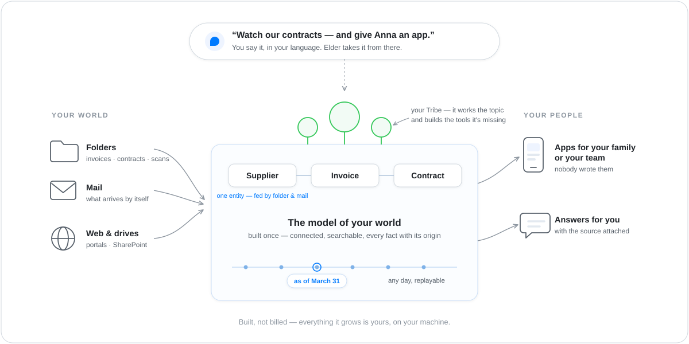

# The idea

> Companion to the [README](../README.md). The README is the
> 60-second pitch; this doc is the deeper *why*.

  

## A day in the wild

Imagine the drawer where your household paperwork collects —
invoices, insurance letters, contracts. Or the folder on the
department share where supplier invoices land. Somebody has to
read all of it, remember the due dates, notice the odd one out.
Usually that somebody is you. You open The Wild and say:

> *"Watch this folder. I care about due dates and cancellation
> windows — and my partner should be able to see our contracts."*

**Elder** — the gatekeeper of the wilderness, the one fixed point
that talks to every user — listens. Asks a few questions: alert
where? check how often? who may see what? Then it offers to spawn
a **Tribe** — a small autonomous community of specialists — and
you say yes.

What happens next is the part most software skips. Before doing
anything, the Tribe **learns what your things *are***: a
connector mounts the folder, extraction reads the PDFs, and
**Atlas** — the Tribe's data ground — pins the model: Contract,
Partner, Invoice; amounts, due dates, notice periods; who relates
to whom. You add your mailbox as a second source, and the power
bill arriving by e-mail lands on the *same* Partner as the
contract from the folder — one entity, two provenance lines. It
doesn't stop at two: every artefact that mentions them — the next
invoice, a bank export, a letter about a tariff change — adds to
the same Partner, and each field keeps a pointer back to the page
it came from.

  

The Tribe's **Chief** runs its cycles: new post ingests itself,
the car-insurance cancellation window is flagged three weeks
ahead. Then a provider switches to a scan format the extractor
can't read. The Chief doesn't shrug and re-read harder — it walks
to the **Forge**, the Tribe's smithy, with a spec, and minutes
later a parser exists that didn't exist before: real code, built
in a sandbox, pinned by content hash, installed behind an
approval gate. You did nothing.

*"Give my partner an app for our contracts."* Elder reads the
model and derives one — a table, a detail card, a cancel-reminder
button — and **appd** serves it into your home network. Your
partner opens it on their phone. Nobody wrote code
([how that works](apps.md)).

Months later an auditor-shaped question arrives — *"what did we
know in March?"* — and the Tribe answers from its event stream,
as of March 31st, sources attached. Nothing was ever overwritten;
the past stayed answerable.

Now count what that day left behind: a model of your contracts
that answers questions from structure, a parser that runs as
plain software, an app on your partner's phone. All of it built.
None of it rented. That's The Wild — not an application you start
and stop, a tribe that takes a domain over and grows.

## Build, don't burn

The obvious way to get AI automation is to point a capable model
at everything you own and let it read whatever the task needs,
whenever the task comes. It works — and it never stops costing.
Every question re-reads the sources. Every answer evaporates the
moment it's given. After a year of spending, you own nothing you
didn't own at the start.

The Wild makes one different bet, and everything in the story
above follows from it:

> **When the system meets a problem, it builds something — and
> the thing it builds stays, and is yours.**

It builds three kinds of things, each standing on the one before.

### First it builds a model of your world

The entity you just watched — Stadtwerke Nord, fed by four
artefacts — is not a lucky summary. Behind it stands a **type**
the Tribe declared once: Partner, with its fields and their
kinds, its relations to other types, and the actions it permits.
The record you see is an instance; the type is one node in a
model of your whole domain — and everything else reads that
model: the answers, the apps, the workers. Nobody re-invents
what a Partner is.

  

One type is not yet a domain. What makes the model load-bearing
is that the types know each other: a Contract belongs to a
Partner, an Invoice is billed under a Contract, a Payment settles
an Invoice. Those named relations are why *"which contracts renew
in the next sixty days?"* is a walk over a graph rather than a
guess. And because each type also declares what may be **done**
to it, the same model says which actions the Tribe may take on
its own and which wait for you — sending a reminder, yes; writing
an invoice off, not without a person.

  

This whole structure — types, relations, effects — is the
**ontology** ([ontology.md](ontology.md)), and talking to Elder
*is* the modelling step: you describe your sources and what
matters, the ontology that comes out is a durable thing that
outlives the conversation. Compare that, row by row, with
pointing a model at your files:

  

| | Read it all, every time | Model it once |
|---|---|---|
| **Per question** | every source re-read into a context window | one query against a model that already exists |
| **Cost** | grows with every question, forever | front-loaded; questions get cheap |
| **Answers** | the model asserts from fragments it just read | records answer, each naming its source |
| **Permission** | nothing to attach a grant to | the ontology *is* what grants attach to |
| **Exposure** | your corpus travels into the window | a query result travels; the corpus stays |
| **History** | each run is thrown away | an event stream — earlier states replay |

The permission row is the one that gets underrated. It isn't "we
also have access control" — it's structural. When the unit of
work is a context chunk, there is no object a grant could sit on:
you cannot grant a field, revoke a type, or audit who saw which
record, because none of those exist as things. In The Wild they
do — `customer_visible` is a mark on a Type or a Field, and it
governs both seeing and writing. The same is true for provenance:
an answer names its source file because the fact was stored with
its origin, not because a model remembered where it read
something. And the model is the property everything else leans
on: throw away every prompt and the knowledge survives.

Be fair about the other side, because it's sometimes right. For a
one-off question over material you'll never touch again, pointing
a model at it and paying for the read is the correct trade — The
Wild's setup earns nothing there. The trade flips as soon as the
same domain comes back: the read-everything approach pays full
price on every repeat, while a model you built once keeps
answering, and each new source makes it richer instead of making
the next read longer.

**Be precise about the time axis.** What replays today is the
*knowledge* axis: what the Tribe knew, and when — event-sourced,
with deterministic as-of reads. Asking *"what did we know in
March?"* works. The second axis — since when a fact was true in
the world, independent of when you learned it — is designed but
not yet readable (ADR-0201);
until it lands, this is replayable knowledge, not bitemporal
records.

> 🔍 **Dig deeper — the ground this rests on.**
>
> - **Concept:** [`ontology.md`](ontology.md) (the model in plain
>   words) · `atlas.md` (event stream, provenance,
>   as-of reads) · `atlas-vocabulary.md`
>   (every mark, with its shipped state).
> - **Permission:** `customer_visible` —
>   ADR-0083 ·
>   ADR-0220. Role-based access over
>   proposals is a separate, opt-in gate (`WILD_RBAC_ENABLED`,
>   off by default — [`config-vars.md`](config-vars.md)).
> - **Time:** ADR-0201 — the
>   valid-time carrier and the two-axis read.

### Then it forges its own tools

The model answers questions. But a domain also has *work* in it —
and the day the work demands a tool nobody has, most systems
reach for the same answer: let the LLM do it by hand, every time,
token by token. A scan format the extractor can't read becomes a
model reading that scan every month, forever.

That costs twice. The tokens, obviously — the same scan billed
every month. But the worse cost is **noise**: a model reading the
same scan twice gives two readings — usually close, never
guaranteed identical — and "usually close" has no place in your
books. Recurring work wants determinism, and determinism is what
code has and models don't.

  

The Wild's answer is the **Forge**, and it is the same bet again
at the level of code: meet the problem once, build the tool,
keep it. When the Chief notices a gap — *"I need something that
parses XML sitemaps"* — it walks to the Forge with a spec, and
the Forge builds real software:

- The LLM writes **Rust source** against a strict crate
  allowlist — no free imports, no surprise dependencies.
- A sandboxed container builds it into a **WebAssembly
  component**: no ambient filesystem, no ambient network, only
  the capabilities its contract grants.
- The result is **signed and pinned by content hash**, pushed as
  an OCI artefact, and installed behind an approval gate.
- Next cycle, the tool is just there — and it is **remembered**:
  the Tribe knows what it forged, from which spec, and can reach
  for it again.

And "tool" is understating it. The Forge builds two shapes of
thing: **tools** — parsers, converters, fetchers, calculators
that answer a call and return — and whole **workers**, components
that subscribe to the Tribe's events and work over time, like a
notifier that watches due dates or an indexer that keeps a search
current. A Tribe is not limited to the abilities it shipped with;
it can build abilities nobody knew it would need.

Two fences keep that power honest. The Forge can never build
itself new *doors*: filesystem and network adapters are not
forge-buildable, so a forged component can only ever act through
capabilities you already granted. And once forged, the tool runs
as plain compiled software — the LLM wrote it once, no model sits
in the loop when it runs, which is exactly the point: the token
was spent on building, the build keeps paying, and the answer
stops wobbling.

The line The Wild draws is that simple: **judgment goes to the
model, repetition goes to code.** Anything that will happen twice
is worth building.

> 🔍 **Dig deeper — the smithy.**
>
> - **Concept:** `forge/README.md` (the
>   sandboxed build pipeline) ·
>   [`skill-vs-tool.md`](skill-vs-tool.md) (what a Forge
>   produces).
> - **Why only tools and workers are forge-buildable:**
>   ADR-0012 ·
>   output provenance
>   ADR-0037 ·
>   autonomous forge
>   ADR-0046.
> - **Config:** extra crates the Forge may pull →
>   `forge/allowlist.toml` (then `wild forge allowlist sync`).

### Then it derives apps for the people around you

The third build closes the loop to other people. *"Give my
partner an app for our contracts"* is one sentence, and what
comes back is not a chat window — it's an app: a table, a detail
card, a button, served into your network, opened on a phone.
Nobody wrote it, because nobody had to: the model already knows
what a Contract is, which fields matter, and who may see them —
the app is **derived** from the ontology, and `customer_visible`
governs what each person sees and may do. A new field in the
model shows up in the app; a new app costs a sentence, not a
project ([apps.md](apps.md)).

### What still costs tokens — and why that's fine

The Wild is not token-free, and doesn't pretend to be. Elder
talking with you, the Chief deciding what a cycle needs, a
worker drafting a polite reminder — that's judgment, and
judgment is what LLMs are for. The bet is about everything
else: answers come from the model, not from re-reading your
files; forged tools run as compiled code; apps serve from
structure. The system spends intelligence on **decisions** and
turns the rest into things you own — which is why a year of
running The Wild leaves you with an asset, where a year of
prompting leaves you with a bill.

## How it runs

The story has two layers running at once. The **outer layer** is
the arc you steer — sources in, understanding in the middle,
people out, Elder as the spoken bracket over everything:

  

You reach it through whichever door fits: the **Wild.app**
dashboard, your Desktop AI over MCP, the `wild` CLI — and the
people around you reach it through the apps it serves them.

The **inner layer** is what runs underneath each Tribe:

  

A Tribe is a small community of autonomous inhabitants — the
vocabulary is deliberately concrete, because "agent" has come to
mean everything and nothing:

- **Elder** at the system level — onboards new tribes, routes
  you, operates them on your behalf.
- **Atlas** as the ground — the ontology over an event-sourced
  object graph: every fact with its origin, search built in, any
  earlier state replayable.
- A **Chief** per tribe — reads the tribe's **Blueprint** (a
  living Markdown charter), runs cycles, dispatches work.
- **Workers** — the specialists doing actual tasks: parsing PDFs,
  chasing receivables, scoring, drafting. ai-, rule-, shell-,
  api-, or human-backed — or forged: when your topic demands a
  specialist nobody shipped, the Tribe grows its own.
- The **Forge** — the smithy from the section above.

The [cast sheet](diagrams/idea/scenes/04-the-cast.svg) puts all
six on one page, and the
[README](../README.md#why-tribe-why-wild) makes the case that
the names are load-bearing.

Underneath, the sovereignty is structural, not a setting. Every
plugin — forged or installed — runs as a sandboxed WebAssembly
component with no ambient filesystem or network access; every
capability is granted explicitly. Each tribe has its own bus
prefix (`wild.{tribe}.…`), its own storage, its own secrets, its
own forge — tribes can nest (`acme-sales-eu` under `acme-sales`)
but stay strictly isolated: what one tribe knows, another does
not see. And all of it runs on your machine; which model sees
what, and whether any of it leaves the house, is your call.

> 🔍 **Dig deeper — the substrate.**
>
> - **Architecture:** [`architecture.md`](architecture.md) —
>   embedded host, capability model, plugin tiers.
> - **Sandbox & trust:** [`plugin-concept.md`](plugin-concept.md)
>   (three tiers, five flavors) ·
>   [`plugin-trust.md`](plugin-trust.md).
> - **Bus:** `messaging.md` — NATS subjects,
>   JetStream durability, per-tribe isolation at the
>   subject-prefix level.

## Who it's for — the entry ladder

The path into The Wild is deliberately a ladder, and it starts at
home:

- **The home user** — the entry persona. Installs `Wild.app`,
  points it at the household folder, gets the contracts app on
  the family's phones. No server, no IT department, no terminal.
  Everything runs on one machine; with a local model, nothing
  leaves the house.
- **The domain expert** — the accountant, the purchasing lead,
  the operations person. Same system, pointed at a department's
  folder. They are experts in their domain, not engineers — so
  the surface stays plain language, safe defaults, honest status.
  This persona is the product's design gate: every feature must
  be drivable by them, end to end.
- **The operator** — runs The Wild for a team, manages profiles
  and plugin trust tiers, watches the audit trail.
- **The plugin author** — writes new connectors, tools, or
  adapters as WebAssembly components and distributes them via
  OCI. Enters through the
  developer front door.

The ladder is the go-to-market: what runs your kitchen table
today runs an accounts-payable desk tomorrow — same system,
nothing to migrate.

## What it's not (yet)

- **Not a chat front-end.** Claude / Gemini / OpenAI do that
  better. The Wild is the layer **behind** the chat: the orchestra
  that keeps working between your messages.
- **Not multi-operator out of the box.** One operator per install
  today. The people around you get governed, per-person **apps**
  — but co-operating a tribe (shared operation, federation) gets
  its own ADR when there's actual demand.
- **Not a public app store.** There is a curated
  marketplace of connectors, workers, and
  domain packages — but no open third-party marketplace yet;
  community plugins install via explicit `oci://…` refs.
- **Not stable.** Pre-1.0; ADRs are the closest thing to a
  changelog. See the
  developer front door §Status for
  what shipped recently.

## What to read next

- [`ontology.md`](ontology.md) — the ontology in plain words:
  Ingest · Entities · Effects · Workers, and where you see them.
- [`showcase-fitness.md`](showcase-fitness.md) ·
  [`showcase-liquidity.md`](showcase-liquidity.md) — the two
  guided tours, home and business.
- [`how-tribes-live.md`](how-tribes-live.md) — the life-story:
  how a Tribe works, remembers, learns, and forges new abilities.
- [`apps.md`](apps.md) — one sentence to a governed app.
- [`architecture.md`](architecture.md) — the technical *how*:
  embedded host, capability model, plugin tiers.
- [`installation.md`](installation.md) — first install, first
  boot, talking to Elder.
- `elder.md` — how Elder steers the conversation.
