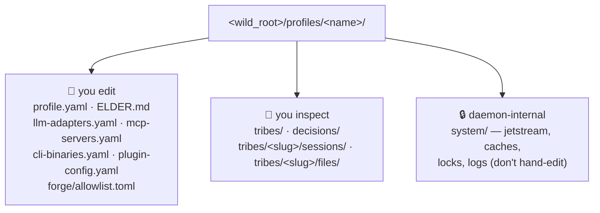

# Inside your install

> Everything The Wild knows lives in plain files under `<wild_root>/` — no
> hidden database, no cloud. This guide is the friendly tour; the
> exhaustive, per-file reference (owner, reader, reload semantics) is
> `profile-layout.md`.

## The shape

One machine can hold several **profiles** (e.g. a `default` and a
work one). Each profile is a self-contained world: its own config,
its own Tribes, its own audit trail.

```
<wild_root>/
├── bin/wild                      ← the binary (curl-installer path)
└── profiles/<name>/              ← one profile = one self-contained world
    ├── profile.yaml              ← required: ports, kind, daemon-spawn
    ├── PROFILE.md                ← auto-generated snapshot of what exists
    ├── 📝 config files           ← you edit these (all optional)
    ├── 🔎 tribes/ decisions/ …    ← your Tribes' state — inspect freely
    └── 🔒 system/                 ← daemon-internal — don't hand-edit
```

The rule for everything editable is uniform: **a missing file means
"use defaults."** You can delete any optional config file and the
daemon still boots.



---

## What you edit — config files

Plain files you tune by hand. The map below groups them by *what
you'd want to change*; the exhaustive table (schema, loader, reload
timing) is in `profile-layout.md`.

| To tune… | Edit | Details |
|---|---|---|
| Elder's persona, tone, org context | `ELDER.md` | `elder.md` |
| Which LLM models run + Chat/Logic/Reasoning routing | `llm-adapters.yaml` | `llm-adapters.md` · `llm-turn-strategies.md` |
| Which external MCP servers a Tribe may reach | `mcp-servers.yaml` | [`mcp-setup.md`](mcp-setup.md) |
| Which on-disk CLI binaries the sandbox may spawn | `cli-binaries.yaml` | [`cli.md`](cli.md) |
| Per-plugin settings (without touching manifests) | `plugin-config.yaml` | `plugin-config-yaml-schema.md` |
| Extra crates the Forge may compile against | `forge/allowlist.toml` | then `wild forge allowlist sync` |
| Which routine, recoverable decisions a Tribe may take on its own | `system/autonomy.yaml` | ADR-0048 (operator-only) |
| The default plugin inventory pulled at boot | `bootstrap.yaml` / `bootstrap.lock` | `bootstrap-and-default-inventory.md` |
| Feature flags & toggles (every `WILD_*`) | environment | [`config-vars.md`](config-vars.md) |
| Secrets (keychain → env chain, ACL grants) | keychain + env | [`secrets.md`](secrets.md) |

> 🔍 **Why `system/autonomy.yaml` lives under the off-limits folder.**
> Everything else in `system/` is daemon-internal, but autonomy is
> *operator authority* — so a Tribe can never write it. The Tribe may
> *suggest* a graduation; you apply it by hand-editing this one file.

---

## What you inspect — a Tribe's state

These aren't config — they're the canonical state The Wild writes as
it works (per ADR-0026). Read
them to see exactly what a Tribe is and knows; edit only deliberately.

| Path | What's there |
|---|---|
| `tribes/<slug>/` | A Tribe: `blueprint.md`, `specs/*.md`, `CHIEF.md`, `workers/*.yaml`, `alarms/*.yaml`, `runs/*.jsonl`, `traces/*.jsonl`. A **pinned idea is the same folder**, carrying `status: dormant` and a `specs/sketch.md` — there is no separate `ideas/` tree. |
| `tribes/<slug>/types/<type>/` | One `wild:data` type — its `schema.generated.yaml` render and editable `index.yaml`. |
| `decisions/<YYYY-MM>/DEC-*.md` | The audit trail: every consequential choice, with its rationale. |
| `tribes/<slug>/sessions/SES-<hex>/` | A chat session: `meta.yaml` + append-only `messages.jsonl` (root-tribe sessions live under `tribes/root/`; co-located per ADR-0117). |
| `tribes/<slug>/files/…` | The `wild:files` content store, co-located with its Tribe (ADR-0117). |

**Tip:** `wild up` regenerates a `PROFILE.md` snapshot of whatever
currently exists — the quickest way to see your install's real
footprint at a glance.

---

## What you don't touch — `system/`

Everything under `system/` is opaque daemon state: the embedded NATS
config + JetStream KV buckets, OCI/plugin caches, the control socket,
locks, and logs. Safe reset: `rm -rf system/` resets the daemon side
**without** touching your `tribes/` / `decisions/` /
`sessions/`. The reverse is not safe — your real state lives *outside*
`system/`.

> 🔍 **Dig deeper.**
>
> - The full per-file matrix (required?, schema source, loader, reload
>   trigger): `profile-layout.md`.
> - The canonical-persistence model (FS is truth, KV is derived):
>   ADR-0026.
> - How a Tribe uses `tribes/<slug>/` while it runs:
>   [`how-tribes-live.md`](how-tribes-live.md).
