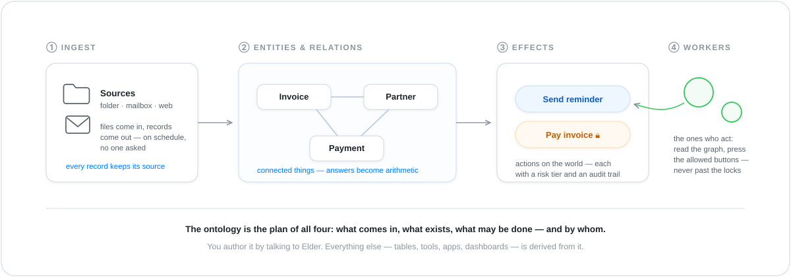
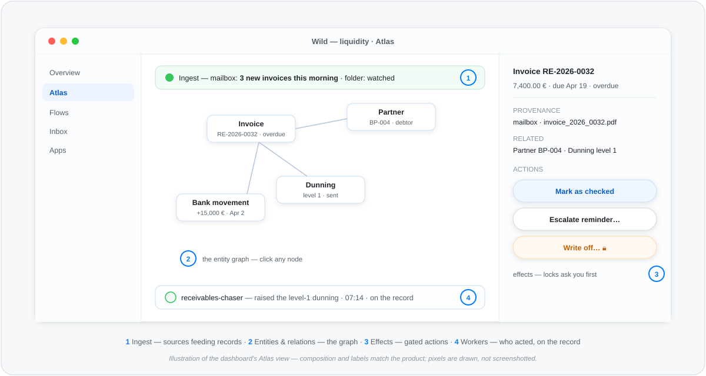

# The ontology — how a Tribe understands your world

> Concept page — no setup required. The deep reference is
> `atlas.md`; the two guided tours
> ([fitness](showcase-fitness.md) · [liquidity](showcase-liquidity.md))
> show an ontology at work.

Every Tribe in The Wild is built around one idea that most
software skips: before doing anything, **learn what the things in
this domain *are*** — and write it down. That written-down
understanding is the ontology. It sounds academic; it's the most
practical object in the system. An invoice is a claim against a
partner with a due date. A workout burns energy at a rate. A
contract has a notice period. Once the system holds those shapes,
your questions become arithmetic instead of guesswork — and
everything else in The Wild is derived from them.

Four moving parts make it concrete:

  

## ① Ingest — how the world gets in

A source is a place your data already lives: a folder, a mailbox,
a SharePoint drive, a web search. You point the Tribe at it once;
from then on, arriving files become **records** on a schedule —
PDFs read, fields extracted, every record stamped with where it
came from. Ingest is declared, not scripted: no one writes a
crawler, and the Chief doesn't burn thought on scheduling.

## ② Entities & relations — what exists

The heart of the ontology: the **types** of things in your domain
(Invoice, Partner, Payment · Food, Workout, Goal), their
**fields** (an amount in euros with two decimals, an IBAN that
checks its own checksum), and their **relations** (this invoice
belongs to that partner; this payment settles that invoice).
Records from different sources land on the *same* entity — the
supplier from the folder and the supplier from the mailbox are one
thing with two provenance lines. Because the connections are real,
questions like *"which debtors are over their limit and 30 days
overdue?"* are computations over a graph, not a language model's
best guess.

## ③ Effects — what may be done

An ontology doesn't stop at knowing; it declares the **actions**
of the domain: send a reminder, mark as checked, schedule a
payment, log a meal. Every effect carries a **risk tier** and
leaves an **audit trail**. Low-risk effects the Tribe uses freely;
high-risk ones — anything that moves money or can't be undone —
are locked behind your confirmation, always. The set of buttons
*is* part of the domain model, not an afterthought in some
workflow tool.

## ④ Workers — who acts

Workers are the Tribe's specialists: one chases overdue
receivables, one delivers notices, one hunts recipes. They read
the entity graph, do their one job, and press only the effect
buttons the ontology allows them — never past the locks. Everything
a worker did is on the record, attributable, replayable.

## Where you see all four

You don't manage any of this in YAML — the dashboard's Atlas view
shows the four parts live:

  

Click any entity and you get its fields, its provenance down to
the source file, its relations, and its allowed actions — with the
locks visible. The worker strip shows who did what, when, on the
record.

## Why this is the quiet superpower

- **Answers you can trust.** Numbers are computed over declared
  shapes, with receipts — not estimated from prose.
- **Memory that survives.** The ontology + the event stream *are*
  the Tribe's knowledge. Throw away every prompt and it's still
  there; ask about last February and it replays.
- **Safety you can see.** What the system may do — and what it
  must ask about — is declared per action, not buried in prompt
  wording.
- **Everything else is derived.** Read tools, search, dashboards,
  and the apps your colleagues use are all generated from the
  ontology. Change the model, and every surface follows.

You author it by talking to **Elder** — *"we deal with invoices,
suppliers, and payment deadlines"* — and refine it the same way.
Plain language in, working domain model out.

> 🔍 **Dig deeper.**
>
> - **The full data-ground reference:** `atlas.md` — intake funnel, storage membrane, the three axes, derived read surface.
> - **The authoring stance:** ADR-0108 — the domain model as constitution · ADR-0093 — toward DDD, gradually.
> - **Worked examples:** the [fitness](showcase-fitness.md) and [liquidity](showcase-liquidity.md) tours; full bundles under [`examples/tribes/`](../examples/tribes/).
