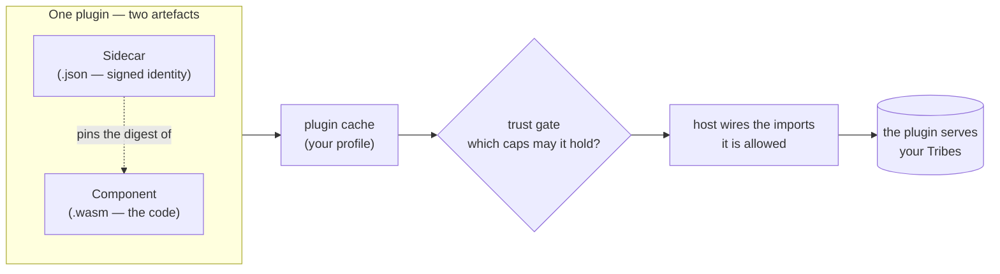
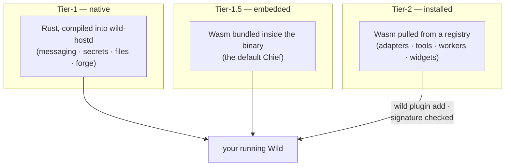
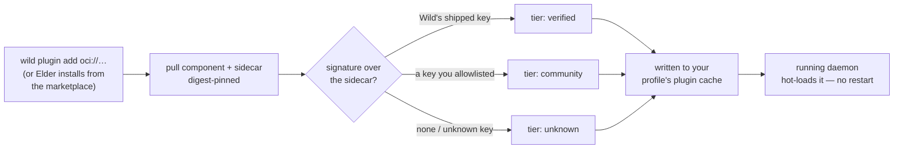
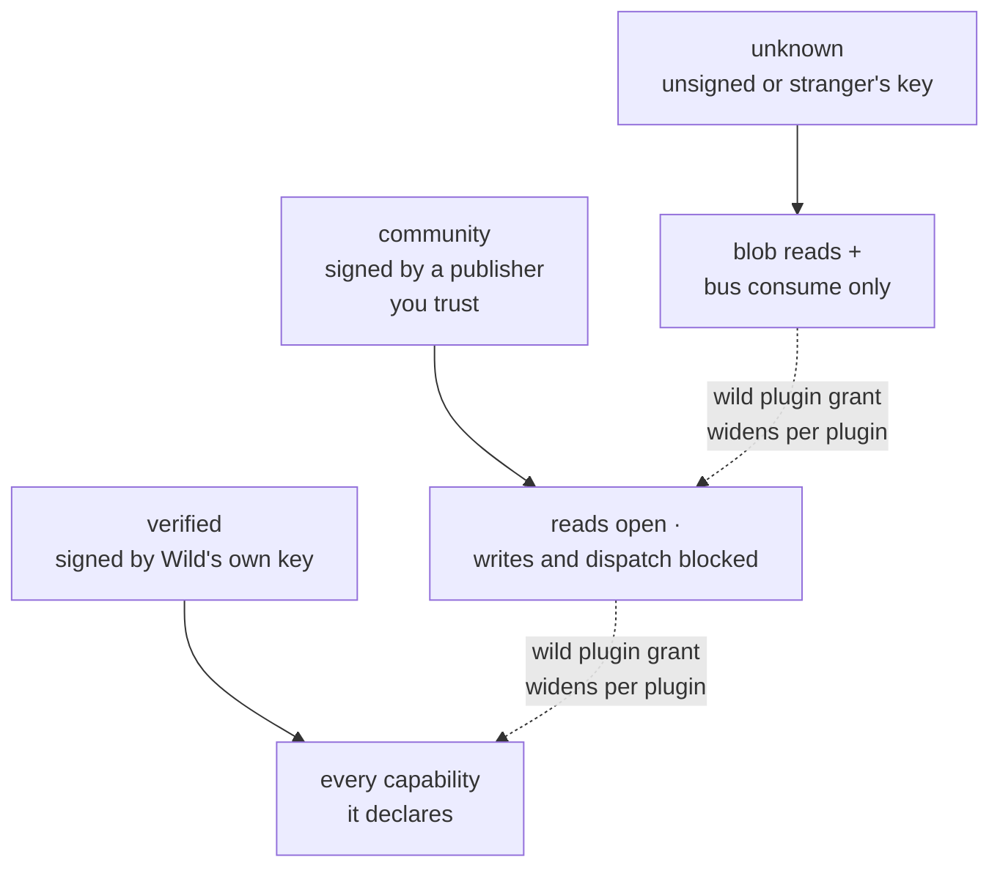

# Plugins — how The Wild grows new abilities

You want your SharePoint documents flowing into a Tribe. Or a
different LLM behind Elder. Or a Gantt card in a derived app. Each of
those is **one plugin**: a small WebAssembly component you install,
trust to a measured degree, and configure for your profile — without
rebuilding or even restarting Wild.

This page is the tour: what a plugin is made of, where its bytes come
from, how you install one, and how Wild decides what an installed
plugin is allowed to do. The precise model behind every claim here is
[`plugin-concept.md`](plugin-concept.md); building your own is
[`plugin-developer-guide.md`](plugin-developer-guide.md).

## What a plugin is

Every installed plugin is **two artefacts**:

- the **component** — a `.wasm` file, the actual code, sandboxed by
  the WebAssembly runtime. It can only call what the host explicitly
  hands it.
- the **sidecar** — a small `.json` manifest: name, version, where
  the bytes came from, what the plugin provides and what it needs.
  The sidecar is what gets **signed**, and it pins the component's
  digest — so a verified sidecar is a verified statement about the
  only bytes that can run.



Both land in your profile's plugin cache. At load time the host reads
the sidecar, checks the plugin's trust tier against what it asks for,
and wires in exactly the capabilities that tier (plus your explicit
grants) allows. A plugin never gets raw OS access — file, network and
secret access all go through host capabilities that can be granted,
denied, and audited one by one.

> 🔍 **Dig deeper — the anatomy.**
>
> - **Concept:** [`plugin-concept.md`](plugin-concept.md) § The sidecar manifest · [`architecture.md`](architecture.md) (where plugins sit in the embedded host).
> - **On disk:** `<profile_root>/system/plugin-cache/<slug>.{json,wasm}` — see `profile-layout.md`.

## Where the bytes come from — the three delivery tiers

A plugin's **tier** answers one question: *where do its bytes come
from?* It says nothing about who wrote it or what job it does.



- **Tier-1** is the host's own flesh: the messaging bus, the secrets
  resolver, the Forge. Native Rust, ships with the release, implicitly
  trusted — you select between backends via config, not a catalog.
- **Tier-1.5** is Wasm that ships *inside* the binary, because a cold
  first boot must not depend on a network pull. Today that is exactly
  one component: the default Chief, the per-Tribe orchestrator.
- **Tier-2** is everything you install: LLM adapters, connectors,
  parsers, workers, widgets. Pulled from an OCI registry (or added
  from a local file), signed, sandbox-gated, hot-loadable.

If you are extending Wild, **you are writing a Tier-2 plugin** — the
other two tiers are the platform itself.

> 🔍 **Dig deeper — the tier model.**
>
> - **Concept:** [`plugin-concept.md`](plugin-concept.md) § The three tiers — including the recognition rule for which tier a capability belongs to.

## What shape it takes — flavors

Within Tier-2, a plugin's **flavor** is the contract it exports — the
shape of how the host talks to it. Two families:

| Family | Flavor | The plugin… | Published sample |
|---|---|---|---|
| **Compute** | tool-provider | answers a synchronous call — an agent-callable tool | [`sharepoint-connector`](../examples/tool-providers/sharepoint-connector/README.md) · [`cash-forecast`](../examples/tool-providers/cash-forecast/README.md) |
| **Compute** | workload | wakes on a bus subscription, publishes outcomes over time | [`annotate-worker`](../examples/workers/annotate-worker/README.md) |
| **Adapter** | llm-adapter | backs `wild:ai/chat` with a model provider | [`echo-llm`](../examples/llm-adapters/echo-llm/README.md) |
| **Adapter** | embed-adapter | backs `wild:ai/embed` — text to vectors | [`hash-embed`](../examples/embed-adapters/hash-embed/README.md) · consumer side: [`embed-consumer`](../examples/consumers/embed-consumer/README.md) |
| **Adapter** | rerank-adapter | backs the retrieve → rerank second stage | [`overlap-rerank`](../examples/rerank-adapters/overlap-rerank/README.md) |
| **Adapter** | storage-adapter | backs the file/blob plane | *(seam defined; none bundled yet)* |

Alongside the flavors sit three further shapes: the **Chief** (the
per-Tribe orchestrator — a kind of its own), **Channels** (transports
that carry conversation to an external party, like Telegram —
teaching sample: [`journal-channel`](../examples/channels/journal-channel/README.md)),
and **Widgets** (new card kinds for derived apps' dashboards —
teaching sample: [`sticky-note`](../examples/widgets/sticky-note/README.md)).
They install and are trust-gated exactly like any other Tier-2
component.

> 🔍 **Dig deeper — flavors & contracts.**
>
> - **Concept:** [`plugin-concept.md`](plugin-concept.md) § The flavors · [`skill-vs-tool.md`](skill-vs-tool.md).
> - **Contracts:** the WIT packages under `wit/` — start at `wit/plugin-meta/` (what every plugin exports) and the flavor package you target.

## Installing a plugin

Three routes lead to the same place:

1. **Ask Elder.** The marketplace is Elder's to search — "connect my
   SharePoint" ends in a confirmed install offer. This is the
   operator path: you confirm what the plugin gets (secrets, sign-in,
   network), and the system does the rest.
2. **The CLI, from a registry:**

   ```sh
   wild plugin add oci://ghcr.io/wildstuff/plugins/tools/math-tools:0.3.0
   wild plugin enable math-tools
   ```

3. **The CLI, from a local file** — your own build, or one you were
   handed: `wild plugin add ./my-plugin.wasm --name my-plugin`.
   Unsigned local adds land at the lowest trust rung and earn
   capabilities only as you grant them.



Installing writes the pair into your profile's plugin cache;
**enabling** is per-profile, so one installed artefact can be on in
`prod` and off in `dev` without touching the bytes. A running daemon
applies add / remove / enable / disable / config live — no restart.
Updates offered by the plugin feed are applied with
`wild plugin upgrade <slug>`, which keeps the previous digest as a
rollback anchor.

Configuration is per-profile too: `wild plugin config <slug> <key>
<value>`, validated against what the sidecar declares. Secrets are
never config values — a plugin names a **secret alias**, and you
grant the actual secret through the secrets flow
([`secrets.md`](secrets.md)).

> 🔍 **Dig deeper — the operator surface.**
>
> - **CLI:** `plugin-cli.md` — every verb (`add`, `install`, `upgrade`, `enable`, `config`, `grant`, `publisher`, …).
> - **Marketplace:** `marketplace.md` — offerings, search-by-intent, the three install shapes.
> - **On disk:** `profile-layout.md` · defaults in `bootstrap-and-default-inventory.md`.

## Trust — how much a plugin is allowed

Wild does not ask you to *believe* a plugin's publisher. The trust
tier is **derived from a signature**, never read from a claim: every
sidecar may carry a detached ed25519 signature, and *which key
verifies it* decides everything.

```text
signature verifies against the key that SHIPS with Wild   → verified
signature verifies against a key YOU allowlisted          → community
no signature, or one that verifies against neither        → unknown
```

Two rules are enforced by construction, not by convention:

- **Nothing raises itself.** A publisher writing `"tier": "verified"`
  into their sidecar changes nothing — the token is a claim, the
  signature is the fact.
- **You may lower, never raise.** You can allowlist a publisher (that
  earns their signatures `community`) or distrust one down to
  `unknown`. You cannot mint `verified` — that rung means "signed by
  the key that ships with this binary".

The tier then decides the default capability allowance:



An unsigned plugin still installs — it simply *earns* nothing: blob
reads and bus consumption, and every further capability is an
explicit, per-plugin `wild plugin grant` you issue with your eyes
open. When the load-time gate denies a capability, the error itself
carries the exact grant command that would allow it — the recovery
path is always in the message.

Trust decisions are machine-wide, not per-profile: your publisher
allowlist and grants live in `<wild_root>/plugin-trust.json`, managed
entirely through `wild plugin grant / revoke / grants` and
`wild plugin publisher add / rm / ls`.

> 🔍 **Dig deeper — trust & signatures.**
>
> - **Concept:** [`plugin-trust.md`](plugin-trust.md) — the file shape, the allowance map, the auto-grant on confirmed connector installs.
> - **CLI:** `wild plugin grant <slug> --cap <qname>` · `wild plugin publisher add <name> --key <hex>` — `plugin-cli.md`.
> - **On disk:** `<wild_root>/plugin-trust.json` (system-wide, 0600).

## Building your own

The developer path in one paragraph: pick the flavor whose contract
fits, copy a published sample, point your WIT imports at the
published `wit/` packages, build with the standard Rust
`wasm32-wasip2` toolchain, and `wild plugin add ./target/...wasm`.
Your plugin starts at `unknown` trust on your own machine — grant it
what it needs, and sign the sidecar when you distribute it.

Start here:

- [`plugin-developer-guide.md`](plugin-developer-guide.md) — the
  handbook: toolchain, WIT layout, worlds, walkthroughs, debugging.
- [`../examples/README.md`](../examples/README.md) — the published
  samples index; `examples/tool-providers/sharepoint-connector/` is
  the richest single reference (one component exercising four
  primitives, and the most complete sidecar).
- `plugins/tool-provider-scaffold/` — the macro crate a tool-provider
  author copies from.

## Configuration reference

| You'd tune | Where | Detail |
|---|---|---|
| install / enable / upgrade | `wild plugin …` | `plugin-cli.md` |
| per-plugin config values | `wild plugin config` → profile `plugin-config.yaml` | `plugin-config-yaml-schema.md` |
| capability + secret grants | `wild plugin grant` → `<wild_root>/plugin-trust.json` · `secret-grants.json` | [`plugin-trust.md`](plugin-trust.md) · [`secrets.md`](secrets.md) |
| publisher allowlist | `wild plugin publisher` → `<wild_root>/plugin-trust.json` | [`plugin-trust.md`](plugin-trust.md) |
| LLM adapter instances | `llm-adapters.yaml` (not `plugin config`) | `llm-adapters.md` |
| what ships by default | the bootstrap inventory | `bootstrap-and-default-inventory.md` |

The exhaustive per-profile file map is
`profile-layout.md`.

## Glossary

| Term | One line | Where |
|---|---|---|
| **Tier** | Where the bytes come from: native · embedded · installed | § Where the bytes come from |
| **Flavor** | The contract a Tier-2 plugin exports | § What shape it takes |
| **Sidecar** | The signed `.json` identity next to the `.wasm` | § What a plugin is |
| **Trust tier** | verified · community · unknown — derived from the signing key | § Trust |
| **Grant** | Your explicit per-plugin capability widening | § Trust |
| **Publisher** | A signing key you chose to trust at `community` | § Trust |
