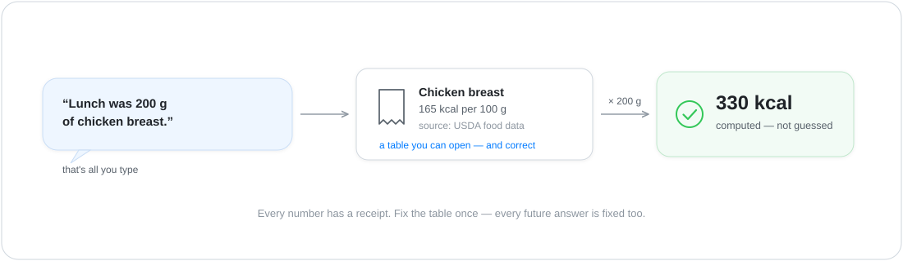
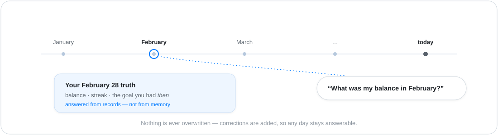

# Your own coach — the fitness showcase

> The **home end** of the showcase ladder — the business end is
> [the liquidity desk](showcase-liquidity.md).

You've probably tried tracking what you eat. Everyone has: an app
full of ads that wanted a subscription, a spreadsheet that died in
week two, or a chat assistant you told everything — and that
remembered none of it a month later.

This showcase raises a Tribe that is **your own coach**. It lives
on your machine, keeps your books, and answers the only question
that matters: *am I on track?*

You tell it: *"Lunch was 200 g of chicken breast, and I ran half
an hour this morning."* That's it. No forms, no dropdowns. The
coach writes two records, computes the calories on both, and
updates your balance.

<p align="center">
  
</p>

## What you get — that a chat assistant can't give you

**It keeps books, not chat history.** Every meal and every workout
becomes a dated record — not a sentence in a conversation that
scrolls away. That difference sounds small and changes everything:
in March you can ask *"what was my balance in February?"* and get
the true answer, computed from February's records — not a language
model's vague recollection of something you once said. Your
history survives every new conversation, every new phone, every
new AI model.

**It computes — it doesn't guess.** Ask a chatbot how many
calories your lunch had and you get a plausible-sounding estimate
that changes each time you ask. Your coach answers **330 kcal**
because its reference table says chicken breast is 165 kcal per
100 g and you ate 200 g. Every number has a receipt you can open —
and correct. Fix the table once, and every future answer is fixed
too.

**It fills its own gaps.** You log a bowl of pho; the table
doesn't know pho. The coach doesn't shrug — it looks the
nutrition up on the web, saves it *with its source*, and then
logs your lunch. Your reference tables grow by being used. It
even hunts for recipes matched to your goal and profile while you
sleep.

**One number, honestly computed.** Calories in minus calories out
over a rolling week, held against your goal. Not a dashboard of
forty widgets — the one number, and it's real.

**Your people can see it — without your login.** Say the word and
your partner or trainer gets a small app on their phone showing
the balance and the streak. Nobody wrote that app; it's derived
from what the coach knows.

## Why this needs an "ontology" — in plain words

The word sounds academic. What it means here is simple: **the
coach knows what things *are*, not just what you said.**

A food is a thing with an energy density. A meal is *you eating a
quantity of that thing on a date*. A goal is a line to hold.
Because the coach knows these shapes and how they connect, it can
**do arithmetic on your life**: total a day, compare a week
against the goal, spot that a food's stated calories don't match
its own protein and fat numbers. A chat assistant knows none of
this structure — it only has your words, so all it can do is
*sound* right.

That's the quiet superpower behind every showcase in The Wild:
first the system learns what your things *are*; then everything
else — honest numbers, real memory, apps for your people —
follows from it.

## "What was my state in February?"

Because every log is kept as an event in order — nothing
overwritten, corrections appended — your history is *replayable*:

<p align="center">
  
</p>

Ask with a date and the coach answers from the world as it was
*then* — including the goal you had set at the time, not the one
you changed last week. Even a corrected typo keeps its history.
No fitness app and no chat assistant does this; here it comes
free from how The Wild stores everything.

## Try it

The bundle ships ready to run — reference tables seeded (~37
foods, ~25 exercises, ~15 recipes) and a week of sample logs, so
the balance has something to say from minute one. Today it
deploys from the terminal (one-click install from the marketplace
is where this is headed):

```bash
wild tribe apply examples/tribes/fitness-tracker --as alice-fitness
```

Web lookup wants the optional `BRAVE_KEY` secret; everything else
runs with no credential at all.

> 🔍 **Dig deeper — how it's built.**
>
> - **The whole bundle:** [`examples/tribes/fitness-tracker/`](../examples/tribes/fitness-tracker/) — the ontology (`ontology/model.yaml`), the seeded tables, the worker briefs, the coach's charter.
> - **The data ground:** `atlas.md` · ADR-0108 — the domain model as constitution.
> - **Time travel:** ADR-0201 — bitemporal records; the [liquidity showcase](showcase-liquidity.md#the-auditor-question--the-showstopper) tells the full two-axis story.
