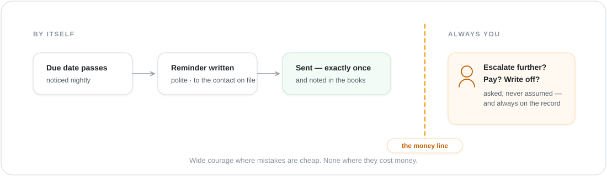
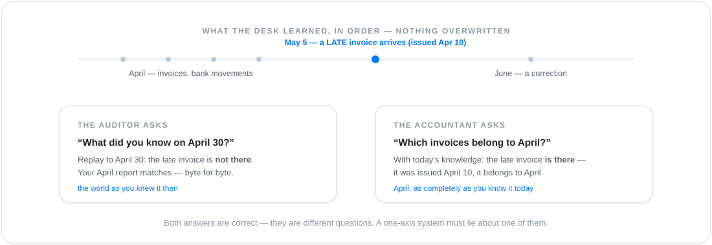

# The liquidity desk — the business showcase

> The **business end** of the showcase ladder — the home end is
> [the fitness coach](showcase-fitness.md).

If you run a small business, you know the daily questions: *Who
hasn't paid? Whom do I have to remind — again? Can I cover
everything due next month?* Today they're answered by a
spreadsheet, a folder of PDFs, and someone's memory — usually
yours, usually at night.

This showcase raises a Tribe that runs that desk. Invoices, bank
movements, and business partners flow in from the files you
already have; the Tribe keeps the books current, chases what's
overdue, finds the discounts you're leaving on the table, and
watches the next thirteen weeks of cash — the horizon German
insolvency law cares about (§ 17 InsO).

Here's the feel of it. One of the sample invoices — 7,400 € to a
customer, due April 19 — goes overdue. With no one asking:

<p align="center">
  
</p>

The reminder went out by itself. Escalating it — or writing the
invoice off, or *paying* anything — did not. That line is the
whole design.

## What you get — that a spreadsheet and a chatbot can't give you

**The chasing happens without you.** Overdue is noticed nightly,
the first reminder writes and sends itself (to the contact on
file — never to a guessed address), and each one happens exactly
once. Your evening stops containing the sentence "I still have to
remind Meyer."

**Money it finds for you.** One sample supplier invoice carries
2 % early-payment discount within 10 days. The desk flags it the
moment the invoice arrives: pay by the date, keep **170 €**. Not
because someone remembered — because the invoice *knows* its own
discount terms.

**A paid invoice knows what paid it.** When the bank statement
shows +15,000 € "Payment RE-2026-0031", the desk matches it to
the invoice and records the link — amount, date, confidence. Six
months later, "show me how this was settled" is one click, not an
afternoon.

**Autonomy stops at the money line.** Marking an invoice as
checked? The Tribe does it freely. Approving a payment? Asks you.
Executing one, writing off a debt? **Always you.** The system's
courage is wide where mistakes are cheap and narrow where they
cost money — and every action it did take is on the record.

**Thirteen weeks of headlights.** Expected money in, committed
money out, week by week — and the earliest gap named before it
arrives, while there's still time to act.

**Your team gets a cockpit.** Open receivables, who owes what, a
due-date calendar, a verify button for the finance group — as an
app in the browser. Nobody coded it; it's derived from what the
desk knows, and each person sees only what they're allowed to.

## Why the ontology is the point here

A spreadsheet stores what you type. This desk knows what an
invoice **is**: a claim, against a partner, with a due date,
direction, discount terms — connected to the bank movement that
settles it and the reminder that chases it. Because the *things
and their connections* are real, the work can be real: aging,
matching, discount math, and the thirteen-week view are
computations, not estimates. Ask a chat assistant about your
receivables and it will summarize whatever text it was shown —
plausibly, differently each time, receipts unavailable. Ask the
desk and it computes over records, and every number opens to its
source document.

## The auditor question — the showstopper

May 5th: a paper invoice surfaces in the morning scan batch —
issued **April 10**, almost a month ago. It lands. And now
"April" has two different, equally legitimate answers — a system
with one time axis must lie about one of them:

<p align="center">
  
</p>

Both answers are correct — they're different questions
(*Kenntnisstand* vs *Stichtag*, in the trade). The desk can hold
them apart because it never overwrites: every fact arrives as an
event, in order, forever. And one safety rule on top: time travel
changes *what* you see, never *who* may see it — confidentiality
is always today's.

*Honest status:* the replay ("what did we know on day X") ships
today; the Stichtag as a one-click session setting is accepted
design being built in slices
(ADR-0201) — this bundle is its
named template case.

## Try it

The bundle ships with everything staged: partners, bank
transactions, invoices in both directions as CSV feeds, plus
three inbound-invoice PDFs for the document door. Today it
deploys from the terminal (one-click install from the marketplace
is where this is headed):

```bash
wild tribe apply examples/tribes/liquidity-management
```

Telegram delivery and the credit-bureau lookup stay quiet unless
you provide the respective credentials; everything else runs as
is.

> 🔍 **Dig deeper — how it's built.**
>
> - **The whole bundle:** [`examples/tribes/liquidity-management/`](../examples/tribes/liquidity-management/) — the ontology (`ontology/model.yaml` — types, money math, gated verbs, processes), the sample data, the worker briefs, the cockpit app spec (`apps/liquidity-cockpit.yaml`).
> - **The data ground:** `atlas.md` · ADR-0108 — the domain model as constitution.
> - **Apps:** ADR-0154 — operator-published end-user apps.
> - **Time axes:** ADR-0201 — bitemporal records; the shipped replay read lives in `crates/runtime/wild-data-engine/src/data_engine/store/records_as_of.rs`.
